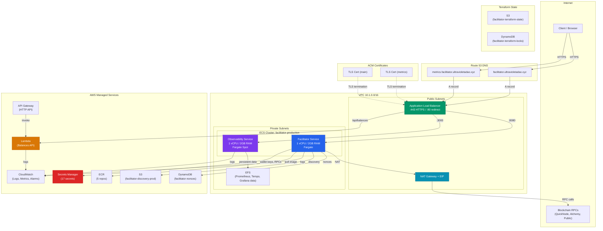
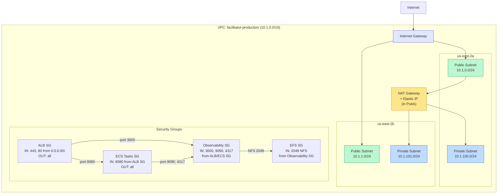
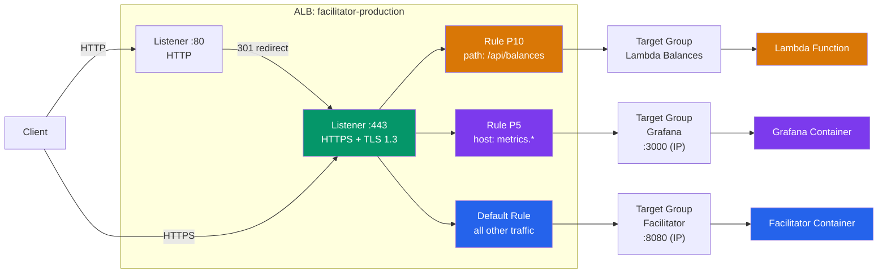
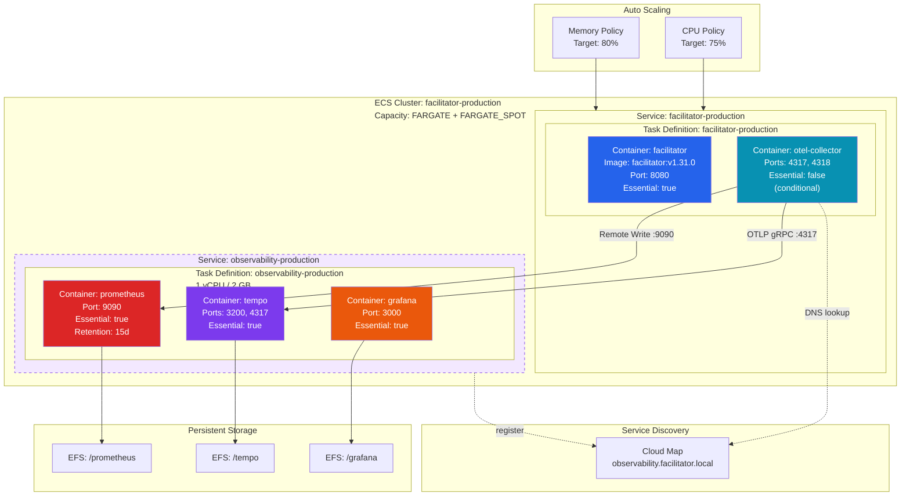
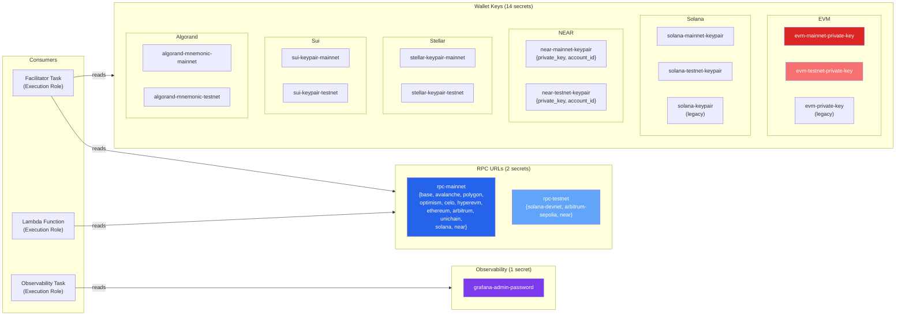
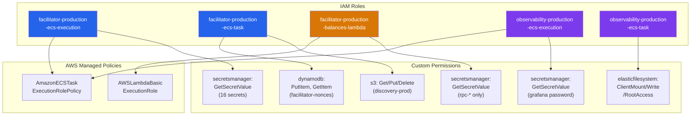
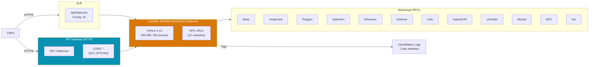
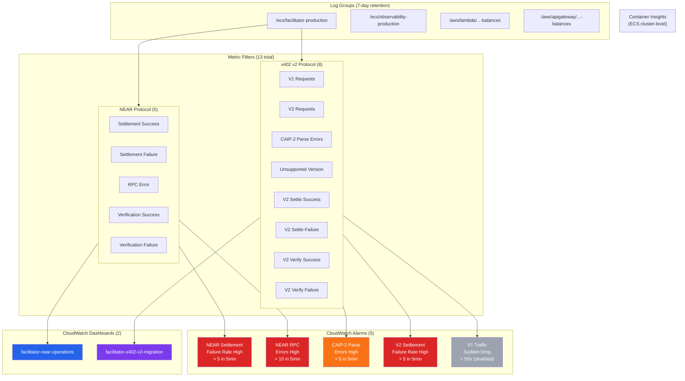
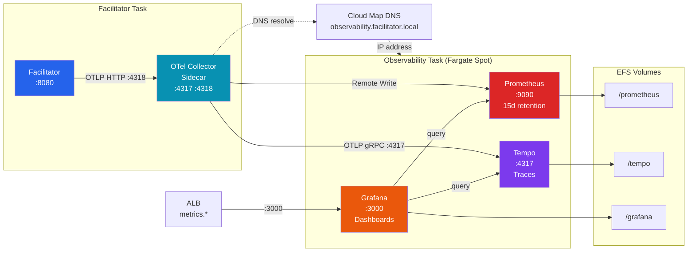
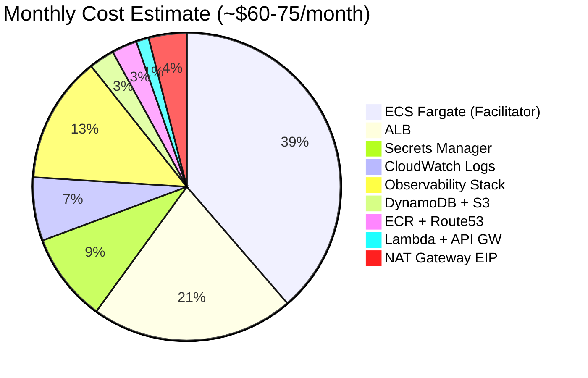

# x402-rs AWS Infrastructure Architecture

> Auto-generated from Terraform analysis. Region: **us-east-2 (Ohio)**

---

## 1. High-Level Architecture Overview

---

## 2. Network Topology

---

## 3. Request Flow (ALB Routing)

---

## 4. ECS Services Detail

---

## 5. Secrets Manager Layout

---

## 6. IAM Roles and Permissions

---

## 7. Lambda Balances API

---

## 8. CloudWatch Monitoring

---

## 9. Observability Data Flow

---

## 10. Cost Breakdown

---

## 11. ECR Repositories

| Repository | Purpose | Always Kept |
|------------|---------|-------------|
| `facilitator` | Main facilitator image | Yes |
| `facilitator-otel-collector` | OTel Collector sidecar | Yes |
| `facilitator-prometheus` | Prometheus for metrics | Yes |
| `facilitator-tempo` | Tempo for traces | Yes |
| `facilitator-grafana` | Grafana for dashboards | Yes |

> All 5 ECR repos are always kept even when observability is disabled, to enable instant re-activation.

---

## 12. Conditional Resources (enable_observability toggle)

Resources that only exist when `enable_observability = true`:

| Resource | Type |
|----------|------|
| Observability ECS Service | `aws_ecs_service` |
| Observability Task Definition | `aws_ecs_task_definition` |
| EFS File System + Mount Targets | `aws_efs_file_system` |
| EFS Access Points (3x) | `aws_efs_access_point` |
| Observability Security Group | `aws_security_group` |
| EFS Security Group | `aws_security_group` |
| Grafana Target Group | `aws_lb_target_group` |
| Metrics ALB Listener Rule | `aws_lb_listener_rule` |
| Metrics ACM Certificate | `aws_acm_certificate` |
| Metrics Route53 Record | `aws_route53_record` |
| Cloud Map Namespace + Service | `aws_service_discovery_*` |
| OTel Collector Sidecar (in Facilitator task) | Container definition |
| Observability CloudWatch Log Group | `aws_cloudwatch_log_group` |

**Cost when OFF:** ~$0/month (ECR repos + ACM cert are free to keep)
**Cost when ON:** ~$10-15/month additional (Fargate Spot + EFS)

---

## Quick Reference

| Component | Value |
|-----------|-------|
| **Region** | us-east-2 (Ohio) |
| **VPC CIDR** | 10.1.0.0/16 |
| **Domain** | facilitator.ultravioletadao.xyz |
| **Metrics** | metrics.facilitator.ultravioletadao.xyz |
| **ECS Cluster** | facilitator-production |
| **Facilitator CPU/RAM** | 1 vCPU / 2 GB |
| **Auto-scale** | 1-3 tasks (CPU 75%, Mem 80%) |
| **ALB Idle Timeout** | 180s (for slow settlements) |
| **Log Retention** | 7 days |
| **Nonce Store** | DynamoDB facilitator-nonces (TTL) |
| **Discovery Store** | S3 facilitator-discovery-prod |
| **Terraform State** | S3 facilitator-terraform-state |
| **Lambda Runtime** | Python 3.12, 256 MB, 30s |
| **TLS Policy** | ELBSecurityPolicy-TLS13-1-2-2021-06 |
