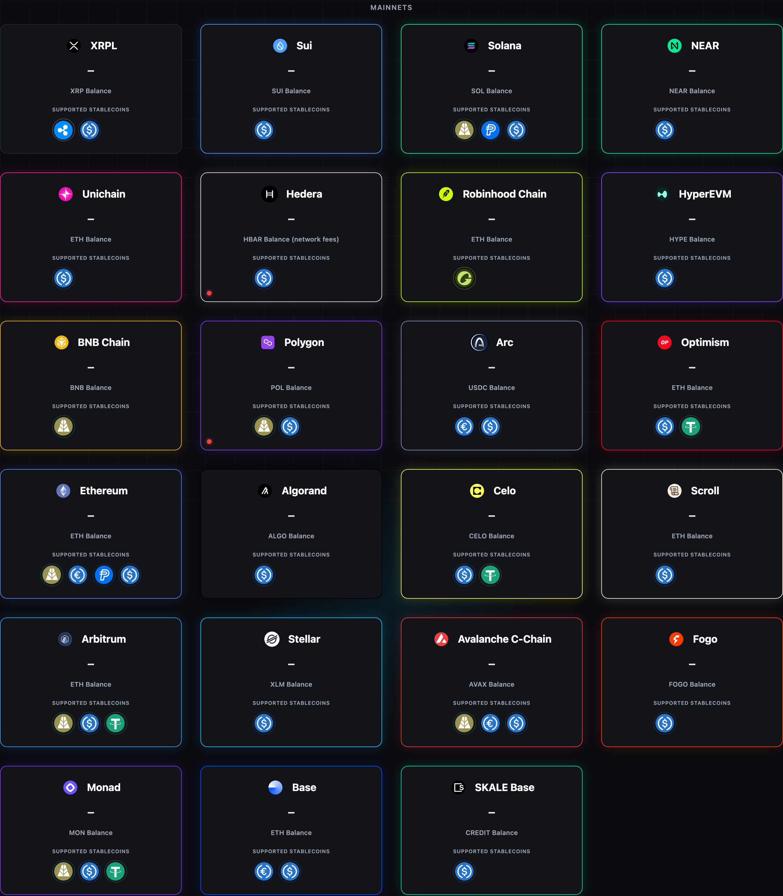
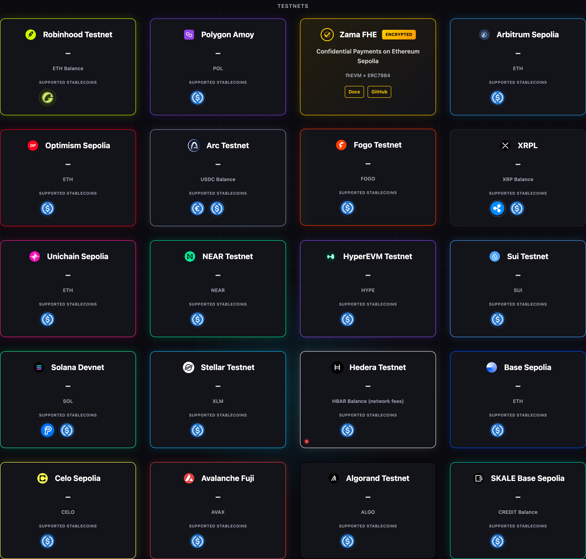
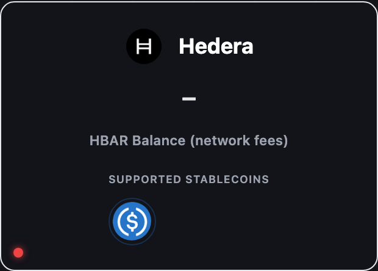

# Una red soportada nunca sale de /supported por su salud (2.39.4) — handoff 2026-09-23

- **Rama**: `c0der/hedera-reprobe`, desde `origin/main` `3056181e` (2.39.3).
- **Encargo**: task_390465101fd3 de c0der, con la directiva del dueño (~13:48Z) que manda
  sobre los puntos 1 y 2: *"even if its degraded it should not be removed ... never remove a
  supported network"*, y un indicador en la esquina inferior izquierda de cada tarjeta.
- **Producción no se tocó.** Solo lecturas públicas (`/version`, `/supported`,
  `/health/ready`) para re-medir; la captura sale de un servidor local.

## Lo medido

13:48Z, 2.39.3, después del redeploy forzado de c0der (13:46Z): `/supported` 156 entradas
con `hedera:mainnet`; `/health/ready` lista `hedera` como `degraded` / `signer_gas_low` (28
settles). O sea, el redeploy curó el síntoma. La causa estaba en el código:
`HederaProvider::from_env` devolvía `Ok(None)` si el health fallaba al arrancar, y nada lo
volvía a probar. Un timeout del probe de consenso (13:30:55Z y 13:31:28Z en los logs de c0der)
dejaba Hedera fuera hasta el próximo deploy. `/health/ready` itera el mismo mapa de
proveedores, así que la red también desaparecía de ahí.

## La decisión

La directiva del dueño resuelve el punto 1: **ninguna red configurada sale de `/supported`
por su salud**. Lo único que deja una red fuera es no configurarla o no compilarla. No
pregunté por los fallos deterministas (llave que no corresponde, chain id equivocado) porque
no los dejo fuera: siguen servidos, con alerta, y `/health/ready` los marca `down` con su
motivo.

Por qué es seguro servir Arc con un RPC que contesta otro chain id: Arc recupera cada firma
localmente bajo SU chain id configurado antes de estimar o enviar (`chain/evm.rs`, rama
`Network::Arc | Network::ArcTestnet` de la verificación). Una firma de la otra red Arc se
rechaza con cualquier RPC. Una firma de esta red enviada a la otra cadena falla el dominio
del token allá. Es el mismo criterio que ya tenían las demás EVM desde 2.39.2. Hedera con una
llave que no corresponde: la co-firma del patrocinador no vale para su cuenta, así que el
consenso rechaza la transacción por firma; el pago falla, no se desvía.

## Qué cambió

| Pieza | Antes (2.39.3) | Ahora (2.39.4) |
|---|---|---|
| Hedera al arrancar (`src/chain/hedera/mod.rs`) | health esperado; si fallaba, `Ok(None)` = fuera hasta el deploy | siempre `Ok(Some)`. El health corre en segundo plano (`watch_startup_health`): primer fallo loguea `hedera_health_failed_at_startup` (misma alarma), reintenta a los 30 s y luego cada 60 s, y al pasar loguea `hedera_health_recovered`. El arranque ya no espera el probe |
| `HederaProvider::health` | `Result<u64, String>`; saldo < 1 max fee era error | `Result<u64, HealthFailure>` con motivo acotado; saldo bajo es `Ok(0)` (readiness lo califica `signer_gas_critical`) |
| Arc al arrancar (`src/chain/evm.rs`, `src/chain_identity.rs`) | `admit` esperado; mismatch = fuera de `/supported` | `admit` eliminado. Arc pasa por el mismo `chain_identity::spawn` que el resto de las EVM. Mismatch: alerta `evm_rpc_chain_id_mismatch`. Sin respuesta: `arc_rpc_chain_id_unverified` y re-probe 30/60 s hasta tener veredicto |
| Resto de las EVM | sin respuesta al chain id: un warn y nada más | re-probe 30/60 s hasta tener veredicto (`rpc_chain_id_verified` o el token de mismatch) |
| `/health/ready` (`src/readiness.rs`) | una red fuera de `/supported` tampoco aparecía; Hedera: cualquier fallo = `rpc_unreachable` | lista toda red configurada. Campo nuevo `caip2`. EVM: pregunta `eth_chainId` en cada refresh y un chain id ajeno da `down` / `rpc_chain_id_mismatch` / `rpc: wrong_chain`. Hedera: `rpc_timeout`, `rpc_unreachable`, `store_unavailable`, `signer_key_mismatch`, `signer_gas_*` |
| Portada (`static/index.html`, `static/x402.js`) | — | punto rojo pequeño que parpadea abajo a la izquierda si la red está `degraded` o `down`; nada si `ok`, si no se sondea o si no se pudo leer |

Providers revisados con el mismo criterio (punto 3): **Hedera** (tocado), **Arc** (tocado),
**chequeo de chain id de todas las EVM** (tocado: re-probe de los que no contestan, y el
chain id entra a readiness). **Solana, NEAR, Stellar, XRPL, Algorand, Sui**: sus `from_env` no
hacen ninguna llamada de red (verificado: ningún `.await` dentro), no hay probe que tocar.
Tampoco hay otro filtro de salud en `FacilitatorLocal::supported`.

El re-probe en segundo plano solo cambia lo que dicen los logs. El estado que ve un humano lo
mide `/health/ready` en vivo en cada refresh (TTL 60 s); no queda congelado en el veredicto del
arranque. El test `a_chain_whose_probe_timed_out_turns_green_without_a_restart` lo fija.

## La portada

Captura a 1440 px, DPR 2, con `prefers-reduced-motion: reduce` para que el punto salga fijo;
sin esa preferencia parpadea (opacidad 1 → 0,25, 1,2 s). Servida en local: la portada de esta
rama, un `/supported` de producción leído a las 13:48Z y un `/health/ready` **simulado** con
`ethereum` `degraded: signer_gas_low`, `hedera` `down: rpc_timeout` (la forma del incidente) y
`hedera-testnet` `degraded: signer_gas_low`. Los saldos son `—` a propósito: el mock no
inventa cifras, y el navegador tenía bloqueado todo lo que no fuera 127.0.0.1. Medido en el
DOM: el punto queda a 11 px del borde izquierdo e inferior de la tarjeta (1 px de borde + 10),
mide 8 px, y `aria-label`/`title` dicen `degraded: signer_gas_low` / `down: rpc_timeout`.

Qué no cambia: tamaños, tipografía, colores y orden de la grilla (el punto es
`position: absolute` dentro de una tarjeta que ya era `position: relative`). Lo único nuevo en
pantalla es el punto. `/x402.js` pasa a `?v=20260923` en la portada para que ningún navegador
con la copia cacheada (1 h) quede sin `cardHealth`; si igual la tuviera, la portada no pinta
nada.

## Tests y mutaciones

Nuevos o reescritos: `a_ledger_failing_its_startup_health_is_still_served`,
`an_unreachable_ledger_fails_its_health_with_a_bounded_reason`,
`the_sponsor_account_answer_is_graded_without_the_network`,
`every_health_failure_has_a_bounded_reason` (hedera);
`a_swapped_arc_rpc_is_reported_and_arc_stays_served`,
`from_env_serves_arc_whatever_its_rpc_answers_and_the_rest_up` (evm);
`the_reprobe_backs_off_to_a_minute_and_stays_there` (chain_identity);
`a_wrong_chain_id_is_listed_down_not_green`,
`a_chain_whose_probe_timed_out_turns_green_without_a_restart`,
`a_hedera_health_answer_grades_with_its_own_reason`,
`a_hedera_ledger_that_fails_its_health_is_listed_with_its_reason` (readiness); tres `card
health` / `landing` en `tests/frontend-capabilities.test.cjs`.

Los tests de Hedera no salen de la máquina: nodos de consenso y Mirror Node en puertos
locales (cerrados, o que aceptan y nunca contestan), tabla de liquidaciones falsa.

Mutaciones, cada una aplicada, corrida y revertida:

| Mutación | Test que la mata |
|---|---|
| Hedera vuelve a "fuera hasta el deploy" (health esperado, `Ok(None)` si falla) | `a_ledger_failing_its_startup_health_is_still_served` — rojo |
| Arc vuelve a quedar fuera con mismatch | `from_env_serves_arc_whatever_its_rpc_answers_and_the_rest_up` — rojo |
| readiness deja de mirar el chain id | `a_wrong_chain_id_is_listed_down_not_green` — rojo |
| la portada pinta punto para un estado desconocido | `card health: a dot only for degraded or down…` — rojo |

El fallo determinista de Hedera (llave ajena) se prueba sobre la respuesta del Mirror Node y
sobre la calificación de readiness, no de punta a punta: exigiría un nodo de consenso gRPC que
conteste, y no quise tráfico a la testnet real desde un test.

## Ronda 2 (refutador: MERGEABLE CON RONDA, 0 P0/P1)

| # | Hallazgo | Qué cambió | Cómo se prueba |
|---|---|---|---|
| P2-1 | `CHANGELOG.md`: la edición reemplazó el encabezado `## [2.39.3]`, así que las entradas de recibos (#100) quedaban publicadas como 2.39.4 | Se repone `## [2.39.3]` debajo de las entradas de 2.39.4 | el bloque 2.39.3 es idéntico byte a byte al de `3056181e` (`diff` de las dos secciones, vacío) |
| P2-2 | "Ninguna tarjeta desaparece" no tenía test: cambiar `paint` por `card.remove()` dejaba 11/11 en verde | Test que ejecuta el cargador real de la portada (`loadNetworkStatus`, sacado de `index.html`) sobre un DOM falso con las 44 tarjetas reales. Pasa por una red degraded, una down, un 429 ilegible y un fetch que falla. En cada paso cuenta las tarjetas, verifica el orden y que ningún `style` se tocó, y que el punto aparezca solo en degraded/down | mutaciones en rojo: `card.remove()`, `card.style.display = 'none'`, fetch fallido que no limpia, idioma que no re-etiqueta |
| P3 | El bucle de re-probe no tenía test: apagarlo dejaba 52/52 en verde | El bucle pasa a `crate::chain::reprobe(probe, delay)`, con el retardo como parámetro. Lo usan Hedera (`watch_startup_health`) y el re-check EVM (`recheck`, que ahora devuelve su veredicto). Dos tests: el bucle pregunta hasta tener veredicto y espera antes de cada intento (retardos 0,1,2,3), y un RPC que no contesta dos veces es juzgado al tercero (`Matches` o `Mismatch`) | mutaciones en rojo: el re-check se rinde con el primer silencio, el bucle no espera, el bucle da una sola vuelta. Los dos tests tienen tope de tiempo, así que un bucle colgado falla en segundos y no a los 35 min del job |
| P3 | Etiqueta del punto solo en inglés | La portada es bilingüe: `netstatus.degraded` / `netstatus.down` en los dos diccionarios (`degradada`, `caída`); el motivo sigue siendo el token. Un cambio de idioma re-etiqueta los puntos sin volver a consultar la ruta | el test de P2-2 cambia a `es` y lee `degradada: signer_gas_low` / `caída: rpc_timeout` |

Lo que queda sin test: que `from_env` de Hedera realmente lance `watch_startup_health`. Para
probarlo haría falta que el health pasara, y eso exige un nodo de consenso gRPC.

## Para c0der

- **Terraform**: solo cambia el texto (comentario y `alarm_description`) de
  `alerts-network-startup.tf`; el patrón del metric filter es el mismo, y los tres tokens se
  siguen logueando igual. `hedera_health_recovered` y `rpc_chain_id_verified` no contienen
  ningún token del filtro. El paso "Deploy observability" lo aplica in-place.
- **La alarma** sigue siendo "una vez por arranque". El re-probe no vuelve a loguear el token
  en cada intento (solo `debug`), así que no queda en ALARM mientras la red sigue mal: eso lo
  dice `/health/ready`.
- **`/health/ready` pide un `eth_chainId` más por red EVM y por refresh** (una ronda por TTL
  por tarea, como antes). El test de concurrencia (≤ 4 llamadas para 20 clientes) sigue verde.
- **La portada ahora consulta `/health/ready`** al cargar y cada 60 s (solo con la pestaña
  visible). La ruta está cacheada 60 s y detrás del governor de lecturas secundarias (ráfaga
  100/IP), así que no multiplica sondas.
- **Rebase de `c0der/emitido-no-retryable`**: esa rama no está en `origin`, así que no pude
  medir el solapamiento. Seguro choca en `CHANGELOG.md` y `VERSION`; si toca
  `src/readiness.rs`, `src/chain/hedera/mod.rs` o `src/chain_identity.rs`, también ahí.
