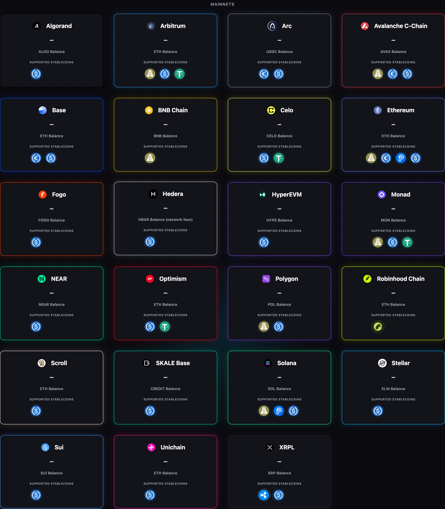
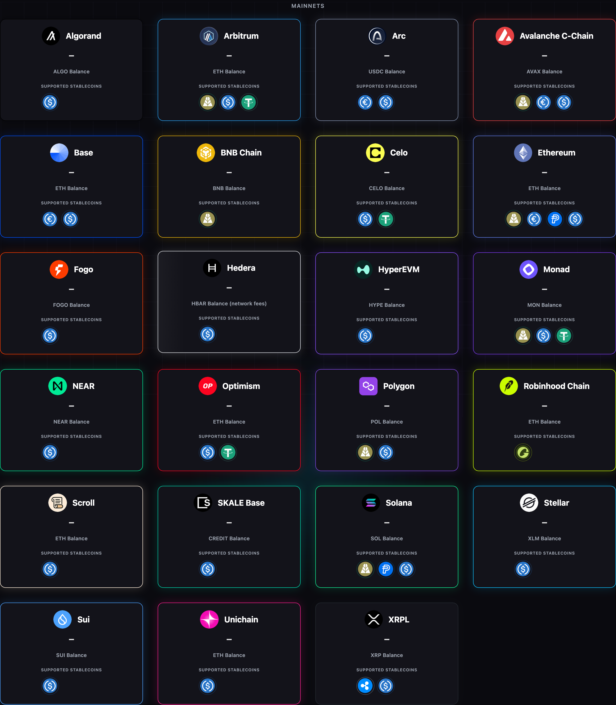
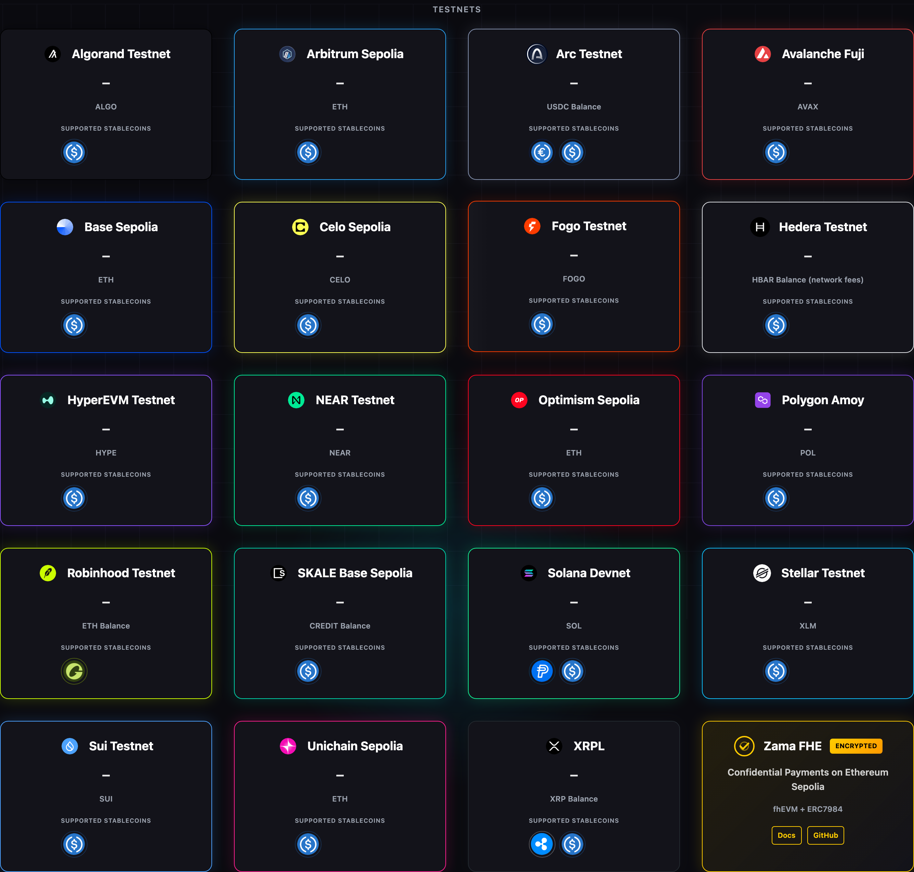
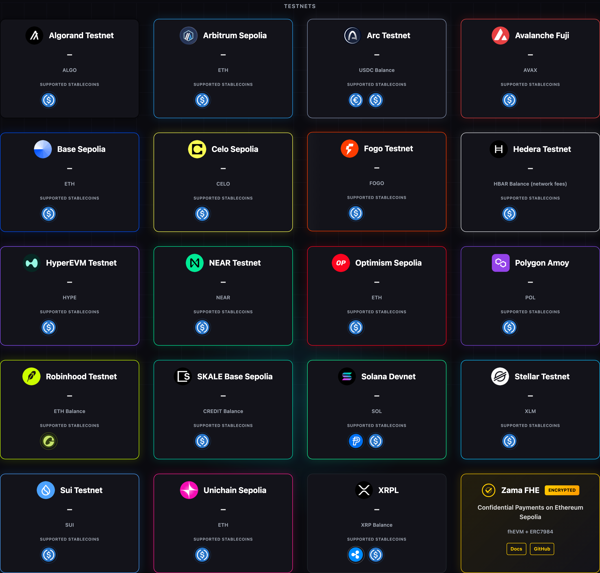
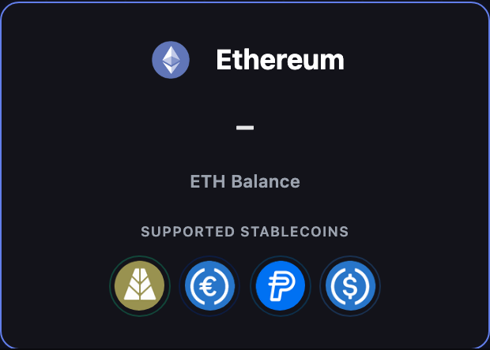
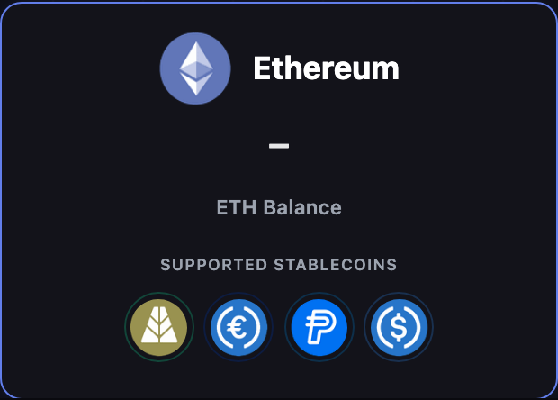

# El logo de cada red, al menos tan grande como los de sus stablecoins (2.39.5) — handoff 2026-09-23

- **Rama**: `c0der/iconos-red`, rebaseada sobre `origin/main` `2309b6d2` (#101 mergeado, 2.39.4)
  con `git rebase --onto origin/main 4e1a1bb0 c0der/iconos-red`. El árbol de `4e1a1bb0` y el de
  `2309b6d2` son idénticos, así que el diff contra main es solo esta ronda. VERSION y CHANGELOG
  2.39.5. #102 (`c0der/emitido-no-retryable`) va como 2.39.6.
- **Pedido del dueño**: *"Los de los blockchains tienen que ser igual de grandes que los de los
  stablecoins, como mínimo"*.
- **Alcance**: solo `static/index.html` (el logo junto al nombre, en las 43 tarjetas de
  Mainnets y Testnets que tienen stablecoins) y su test. Stablecoins, tipografía, colores,
  bordes, orden de la grilla y la barra de filtros, sin tocar.

## La causa, medida

Los PNG de red de 96 px traen 12 px de margen transparente por lado (75 % opaco, medido con
PIL sobre el canal alfa), igual que los de stablecoin. Las stablecoins ya recortan ese margen:
una imagen de 42,67 px dentro de una caja de 32 px deja un glifo visible de 32 px, y la píldora
con su aro mide 38,78 px. Los logos de red no lo recortaban: caja de 32 px, **glifo visible de
24 px**. Excepciones: `arc.png` es 100 % opaco, `hedera.png` 90,27 %, `stellar.png` 81,25 % y
`polygon.png` 70,83 %.

## El cambio

Los 43 `` pasan de `style="width: 32px; height: 32px; object-fit: contain;"` a
`class="network-logo"`. Arc y Hedera conservan su `border-radius: 50%` inline. La regla CSS:

- `--glyph: 40px`, el glifo visible: 40 px ≥ 38,78 px de la píldora.
- La imagen mide `--glyph / --visible`, donde `--visible` es la parte opaca del asset; las
  cuatro excepciones van por selector de `src`, como ya se hace con `rlusd` en las stablecoins.
- Márgenes negativos dejan la huella en el ancho del glifo y en los 32 px de alto que tenía
  la fila. El nombre conserva su separación y queda centrado sobre el logo, y **ninguna
  tarjeta crece**: 220,91 px antes y 220,92 px después, y las capturas miden lo mismo antes y
  después (2672×3056 la grilla, 620×444 la tarjeta).

## Medición (Chrome headless, DPR 2, portada servida en local)

`logo caja` = rectángulo del ``; `logo glifo` = caja × parte opaca del PNG; `stablecoin` =
`.token-logo`; `píldora` = `.token-pill`; `centro nombre − centro logo` = desalineación vertical.

| Ancho | Tarjeta | Antes: logo caja / glifo | Después: logo caja / glifo | Stablecoin / píldora (igual antes y después) | Centro nombre − centro logo | Alto tarjeta antes → después |
|---|---|---|---|---|---|---|
| 1440 | Base (EVM) | 32 / 24 | 53,33 / **40** | 32 / 38,78 | 0 | 220,91 → 220,92 |
| 1440 | Solana | 32 / 24 | 53,33 / **40** | 32 / 38,78 | 0 | 220,91 → 220,92 |
| 1440 | Hedera | 32 / 28,8 | 44,30 / **40** | 32 / 38,78 | 0 | 220,91 → 220,92 |
| 1440 | Ethereum | 32 / 24 | 53,33 / **40** | 32 / 38,78 | 0 | 220,91 → 220,92 |
| 390 | Base (EVM) | 32 / 24 | 53,33 / **40** | 32 / 38,78 | 0 | 220,91 → 220,92 |
| 390 | Solana | 32 / 24 | 53,33 / **40** | 32 / 38,78 | 0 | 220,91 → 220,92 |
| 390 | Hedera | 32 / 28,8 | 44,30 / **40** | 32 / 38,78 | 0 | 220,91 → 220,92 |
| 390 | Ethereum | 32 / 24 | 53,33 / **40** | 32 / 38,78 | 0 | 220,91 → 220,92 |
| 1440 | Avalanche Fuji (testnet) | 32 / 24 | 53,33 / **40** | 32 / 38,78 | 0 | 220,91 → 220,92 |
| 390 | Avalanche Fuji (testnet) | 32 / 24 | 53,33 / **40** | 32 / 38,78 | 0 | 220,91 → 220,92 |

Medido otra vez tras el rebase (2.39.4 servida desde `origin/main` contra esta rama): los
mismos valores. El desfase de centro "antes" es -0,01 px (redondeo), "después" 0.

## Capturas (1440 px)

Antes (`origin/main`, 2.39.4) y después (esta rama), servidas en local con `/health/ready`
todo en `ok` (sin puntos, para que no distraigan) y un `/supported` de producción leído a las
13:48Z. El orden aleatorio de la grilla se fijó por red para que las dos se comparen tarjeta
por tarjeta. Los saldos se ven como `—` a propósito.

| | Antes | Después |
|---|---|---|
| Mainnets, oscuro |  |  |
| Testnets, oscuro |  |  |
| Tarjeta de Ethereum (logo junto a 4 stablecoins) |  |  |

**La portada no tiene tema claro**: no declara `prefers-color-scheme` ni `data-theme`. Con
`prefers-color-scheme: light` emulado se pinta igual que en oscuro (brillo medio 25,8 contra
25,9 sobre 255; lo que difiere son píxeles del fondo animado). Por eso no hay capturas en claro:
serían copias de las oscuras (se sacaron en la ronda 6).

## Test

jsdom no hace layout, así que no puede medir tamaños renderizados. El test de
`tests/frontend-capabilities.test.cjs` («every network logo shows a glyph at least as large as
a stablecoin icon») calcula lo que pinta la página:

- decodifica cada PNG de red con `zlib` (paleta con `tRNS` y RGBA) y mide su parte opaca. Da
  los mismos valores que PIL: 0,7500 / 0,7083 / 0,8125 / 0,9027 / 1,0000;
- lee `--glyph`, `--visible` y las excepciones del CSS, y el tamaño de la píldora de
  `.token-logo` + `.token-pill`;
- exige que cada tarjeta con stablecoins tenga su logo con la clase, que ninguna vuelva a la
  caja fija de 32 px, que el CSS no se aparte del PNG en más de 0,01 y que el glifo pintado sea
  ≥ la píldora.

Mutaciones, todas en rojo: `--glyph` a 32 px, quitar la excepción de Polygon, devolver una
tarjeta a la caja fija de 32 px y quitarle la clase a una tarjeta. La ronda 6 cerró el hueco
que encontró el refutador (ver abajo).

La verificación local de cada job de CI está en el body del PR.

## Ronda 6 (refutador de #103: MERGEABLE CON RONDA)

El refutador midió la vara del dueño en 16 de 16 combinaciones (4 anchos × 2 temas × 2
pestañas), con un mínimo de 1,013 en píxeles.

| # | Hallazgo | Qué cambió | Verificación |
|---|---|---|---|
| P2-1 | El test no guardaba el tamaño: `width: 32px; height: 32px;` en la regla `.network-logo` (M3) o un `style="width:32px"` inline en una tarjeta (M4) seguían en verde | Las tres líneas exactas del informe, después de la línea 275 del test: `width` y `height` de `.network-logo` tienen que salir de `calc(var(--glyph) / var(--visible))`, y ningún `` puede traer `width`/`height` inline | verde sobre la rama (14/14). Mutaciones, todas en **rojo**: M1 `index.html` de main, M2 `--glyph: 32px`, **M3** `width: 32px; height: 32px;` en la regla, **M4** `style="width:32px;height:32px;margin:0"` en la tarjeta de Base, M4b `style="border-radius: 50%; height: 32px"` en Arc, M5 Polygon `--visible: 0.75` |
| P3-2 | Cuatro capturas "claro" (2,5 MB) de un tema que no existe, en un repo público | `git rm` de las cuatro y de sus filas; queda la frase que explica que no hay tema claro | — |
| P3-3 | Zama FHE era el único logo de red chico de Testnets (SVG de 32 px, aro visible de 30) | `width="40" height="40"` con `viewBox="1 1 30 30"` (recortado al borde exterior del aro) y `margin: -4px 0`, así la fila sigue en 32 px | medido en Chrome headless, antes → después: aro visible 30 → **40 px**, fila 32 → 32, tarjeta 220,92 → 220,92 px a 1440 y 180,31 → 180,31 a 390, nombre centrado (≤ 0,01 px) |
| P3-1 | Al pasar el mouse, la píldora crece a 44,6 px | **No se tocó**: comportamiento aprobado | — |

