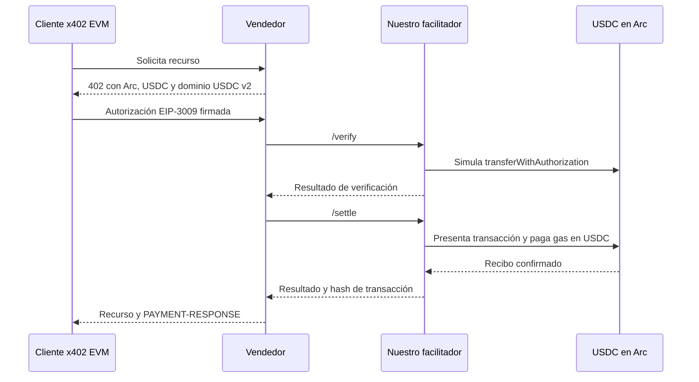

> **Documento histórico.** Este plan se escribió el 2026-09-15, antes de que Arc
> entrara al facilitador, y se conserva tal como quedó junto con su
> [evidencia](../reports/arc-circle-x402-evidence-2026-09-15.json). Su estado
> («listo para iniciar implementación», mainnet sin parámetros publicados) es el
> de esa fecha: `GET /supported` sirve `arc` y `arc-testnet` (medido el
> 2026-09-23). Lo vigente está en [la guía de Arc](../networks/arc.md) y en
> [la operación de Arc](../networks/arc-operations.md).
>
> Los valores `0x` de 64 dígitos hex (aquí los dos `DOMAIN_SEPARATOR`, y en la
> evidencia hashes, resultados de `eth_call` y calldata) están abreviados a sus
> primeros y últimos 8 dígitos por la regla anti-llaves del pre-commit del repo.
> El documento completo está en el tag permanente `archivo/arc-plan-2026-09-15`
> (commit `7fd3fbda`), y los valores se re-derivan on-chain:
> `cast call <token> 'DOMAIN_SEPARATOR()(bytes32)' --rpc-url https://rpc.testnet.arc.io`,
> y los bloques por su número.

# Arc de Circle en el facilitador: investigación y plan de implementación

**Fecha:** 2026-09-15.

**Prioridad:** P0 del facilitador, asignada por el usuario. Seguimiento en [el backlog](../TODO.md).

**Estado:** investigación terminada; listo para iniciar implementación. Este entregable contiene investigación, evidencia y trabajo futuro. No incorpora cambios al código del facilitador.

**Base revisada:** `dc109511`, rama `0xultravioleta/hedera`, versión 2.29.6.

**Objetivo:** verificar y liquidar pagos x402 en Arc desde nuestro facilitador Rust, con un primer lanzamiento verificable en Arc testnet.

## 1. Decisión y alcance del P0

Agregar **Arc testnet, `eip155:5042002`, al proveedor EVM existente**, usando **`exact` con autorizaciones EIP-3009 directas sobre USDC**. Circle documenta expresamente esta forma de patrocinar transferencias mediante un relayer: el comprador firma y nuestra cuenta presenta la transacción pagando gas en USDC. La [guía oficial del relayer](https://docs.arc.io/integrate/relayers-and-paymasters/eip-3009-relayer.md) coincide con la arquitectura de nuestro `EvmProvider`.

El primer lanzamiento exigirá USDC y cuentas EOA, es decir, wallets que firman directamente con una clave. EURC queda investigado y con una tarea de habilitación condicionada a sus propias pruebas positivas. Las wallets de contrato requerirán pruebas independientes; la ruta EIP-6492 tiene una dependencia ausente identificada en esta investigación.

**Circle Gateway/Nanopayments es una integración adicional.** También anuncia `exact` en Arc, pero firma contra otro dominio y liquida por lotes. Incorporar Arc al proveedor EVM no hará compatibles esas autorizaciones automáticamente. La sección 5 define esta frontera y el trabajo necesario si posteriormente se decide soportar Gateway.

El P0 termina con **Arc testnet operativo y anunciado con precisión**, sin depender de una fecha futura de mainnet. La [lista oficial de contratos](https://docs.arc.io/arc/references/contract-addresses.md) todavía identifica sus direcciones como testnet y no publica direcciones mainnet. No crear una red mainnet ni inferir sus parámetros a partir de archivos de génesis del repositorio del nodo.

Entregables de esta investigación: este plan y [las consultas públicas y referencias verificables](../reports/arc-circle-x402-evidence-2026-09-15.json). No se firmaron pagos válidos, financiaron cuentas, enviaron transacciones ni desplegaron contratos.

## 2. Estado local y superficie reutilizable

La búsqueda de `ArcTestnet`, `arc-testnet`, `5042002`, `Circle Arc` y `ARC_TESTNET` no encontró soporte vigente en el código ni en la configuración revisados. No se ha identificado una implementación previa que restaurar.

La arquitectura ya aporta gran parte del trabajo:

- [Network](../../src/network.rs): nombres de red, clasificación testnet, CAIP-2 y despliegues de stablecoins.
- [EvmProvider](../../src/chain/evm.rs): EIP-712/EIP-3009, simulación, patrocinio de gas, nonces del relayer, envío y espera de recibos.
- [Configuración por entorno](../../src/from_env.rs), [readiness](../../src/readiness.rs) y controles existentes de saldo, comisiones, concurrencia y recuperación.
- [Conversión x402 v2](../../src/types_v2.rs) y [facilitador local](../../src/facilitator_local.rs): adaptación al protocolo HTTP y publicación de capacidades.
- [Verificación de comprobantes](../../src/erc8004/proof.rs): filtra logs por la dirección del token antes de comprobar emisor, receptor e importe.

Arc encaja en `NetworkFamily::Evm` y el namespace existente `eip155`. No requiere un proveedor nativo nuevo, un SDK blockchain adicional ni copiar el diseño de Hedera. El checklist local [add-network](../../.claude/skills/add-network/SKILL.md) y la [guía de nuevas redes](../../guides/ADDING_NEW_CHAINS.md) sirven como inventario; los contratos, las comisiones y el código vigente determinan los detalles.

## 3. Parámetros comprobados

### 3.1 Red

| Parámetro | Valor para implementar |
|---|---|
| Nombre | Arc Testnet |
| Variante Rust propuesta / alias local | `Network::ArcTestnet` / `arc-testnet` |
| Identificador x402 v2 | `eip155:5042002` |
| Chain ID decimal / hexadecimal | `5042002` / `0x4cef52` |
| RPC público verificado | `https://rpc.testnet.arc.io` |
| Explorer | `https://testnet.arcscan.app` |
| Faucet | `https://faucet.circle.com` |
| Moneda nativa para gas | USDC, **18 decimales** |
| Interfaz USDC de pago ERC-20 | **6 decimales**, sobre el mismo saldo nativo |
| Comisiones | Transacciones EIP-1559; mínimo documentado de `maxFeePerGas`: **20 Gwei** |

Fuentes: [conexión y endpoints](https://docs.arc.io/arc/references/connect-to-arc.md), [diferencias EVM](https://docs.arc.io/arc/references/evm-differences.md) y [gas y comisiones](https://docs.arc.io/arc/references/gas-and-fees.md).

El RPC devolvió un bloque reciente: **62.258.917**, con timestamp **2026-09-15 16:20:11 UTC**, durante la consulta de las 16:20:12 UTC. `eth_chainId` confirmó la red; `eth_gasPrice` y la base fee observada fueron 20 Gwei, y `eth_maxPriorityFeePerGas` devolvió cero. `eth_feeHistory` respondió correctamente. Son observaciones puntuales, no límites máximos ni mediciones de disponibilidad.

Hay una discrepancia editorial: la página de eventos habla de comportamiento mainnet desde génesis, mientras que la lista de contratos sigue indicando que las direcciones mainnet no están disponibles. Esa referencia no aporta parámetros públicos suficientes para integrar mainnet. El alcance verificable de este plan es testnet.

Viem ya incluye `arcTestnet`. La [definición revisada](https://github.com/wevm/viem/blob/main/src/chains/definitions/arcTestnet.ts) conserva endpoints `.arc.network`; la documentación actual y nuestra consulta emplean `.arc.io`. Configurar el RPC explícitamente en las pruebas y volver a validar cualquier proveedor alternativo al implementarlo.

### 3.2 Tokens y dominios EIP-712

| Activo | Contrato Arc testnet | Decimales ERC-20 | `name` / `version` | Decisión |
|---|---|---|---|---|
| USDC | `0x3600000000000000000000000000000000000000` | 6 | `USDC` / `2` | Obligatorio para cerrar P0 |
| EURC | `0x89B50855Aa3bE2F677cD6303Cec089B5F319D72a` | 6 | `EURC` / `2` | Habilitar después de superar sus pruebas E2E |
| USYC | `0xe9185F0c5F296Ed1797AaE4238D26CCaBEadb86C` | No certificado en esta investigación | No certificado | Fuera del primer lanzamiento |

Las direcciones proceden de [Circle/Arc](https://docs.arc.io/arc/references/contract-addresses.md). Los valores de USDC y EURC se comprobaron mediante `name()`, `symbol()`, `version()`, `decimals()` y `DOMAIN_SEPARATOR()`. Se recalculó el dominio localmente con `chainId = 5042002` y cada contrato:

- USDC: `0x36119152…11c8c6b0`.
- EURC: `0x649ec6b0…e1ebf160`.

Ambos valores coincidieron con el RPC. `authorizationState` devolvió falso para la pareja de prueba dirección cero/nonce cero. Esa consulta comprueba la disponibilidad del método; la protección efectiva contra repetición necesita un pago y un segundo intento en la fase E2E.

El [artefacto oficial `NativeFiatTokenV2_2`](https://github.com/circlefin/arc-node/blob/2a3e8ab10c0ac97bf1a2628a325eb98d4a468b1a/assets/artifacts/stablecoin-contracts/NativeFiatTokenV2_2.json) incluye las variantes `bytes` y `v,r,s` de `transferWithAuthorization` y `receiveWithAuthorization`. Se hicieron `eth_call` con firmas deliberadamente inválidas a ambos overloads en USDC y EURC: llegaron a errores de recuperación de firma. **Esto respalda compatibilidad de ABI y dominio; no demuestra un pago exitoso ni compatibilidad EIP-1271.** El código obtenido en las direcciones de los tokens es el de sus proxies.

EURC expresa euros: la fixture utilizará importe explícito en EURC y no tratará un precio en dólares como una conversión 1:1. USYC tiene características de participaciones con rendimiento y acceso condicionado; requiere otro análisis de autorización, unidades y elegibilidad antes de anunciar pagos. Véase el [modelo de stablecoins](https://docs.arc.io/arc/concepts/stablecoin-native-model.md).

## 4. Compatibilidad del cliente x402

La implementación inicial reutilizará el cliente EVM oficial y el proveedor Rust. Las referencias revisadas son [`@x402/evm`](https://github.com/x402-foundation/x402/tree/6b9302737f16eea7de90b3bf617c045cef23e032/typescript/packages/mechanisms/evm) en el commit `6b9302737f16eea7de90b3bf617c045cef23e032` y la versión npm observada **2.25.0**. Fijar una versión y lockfile en las fixtures; una versión publicada no implica que ya se haya probado contra nuestro servidor.

La tabla upstream [`defaultAssets.ts`](https://github.com/x402-foundation/x402/blob/6b9302737f16eea7de90b3bf617c045cef23e032/typescript/packages/mechanisms/evm/src/defaultAssets.ts) revisada no contiene Arc. El [servidor EVM upstream](https://github.com/x402-foundation/x402/blob/6b9302737f16eea7de90b3bf617c045cef23e032/typescript/packages/mechanisms/evm/src/exact/server/scheme.ts) sí permite un `AssetAmount` explícito. Por tanto, el ejemplo usará contrato, importe y dominio explícitos; un precio abreviado como `"$0.01"` no será el mecanismo de descubrimiento de USDC en Arc.

Requisitos v2 propuestos para **0,01 USDC**; sustituir `payTo` por la dirección pública del vendedor de la fixture:

```json
{
  "scheme": "exact",
  "network": "eip155:5042002",
  "asset": "0x3600000000000000000000000000000000000000",
  "amount": "10000",
  "payTo": "<direccion-EVM-del-vendedor>",
  "maxTimeoutSeconds": 300,
  "extra": {
    "name": "USDC",
    "version": "2",
    "assetTransferMethod": "eip3009"
  }
}
```

Es una plantilla de requisitos, no una respuesta `/supported` ni un pago firmado. Los 300 segundos son una decisión para la fixture, no una obligación de Arc. Verificar con el SDK fijado la serialización completa de `PAYMENT-REQUIRED`, `PAYMENT-SIGNATURE` y `PAYMENT-RESPONSE`.

Flujo esperado:



El comprador autoriza el importe del token y el facilitador patrocina la comisión. La transacción al contrato utiliza `value = 0`: los fondos del pago salen de `authorization.from`. No exige depósito en Gateway, una aprobación ERC-20 previa, CCTP ni Bridge Kit.

## 5. Circle Gateway y Nanopayments

### 5.1 Observación pública del ecosistema

Consultas de solo lectura del 2026-09-15, alrededor de las 16:22 UTC:

| Endpoint `/supported` | HTTP | Entradas `kinds` totales | Capacidad Arc observada |
|---|---|---|---|
| [Circle Gateway testnet](https://gateway-api-testnet.circle.com/v1/x402/supported) | 200 | 12 | v2, `exact`, `eip155:5042002`, USDC con `GatewayWalletBatched` |
| [Circle Gateway mainnet](https://gateway-api.circle.com/v1/x402/supported) | 200 | 11 | Ninguna |
| [Facilitador x402 oficial](https://x402.org/facilitator/supported) | 200 | 11 | Ninguna |
| [Nuestro facilitador](https://facilitator.ultravioletadao.xyz/supported) | 200 | 150 | Ninguna |

Las cantidades cuentan capacidades anunciadas, no redes distintas. La muestra no permite afirmar que Circle sea el único facilitador con Arc.

La entrada de Circle testnet anuncia `name = GatewayWalletBatched`, `version = 1`, `verifyingContract = 0x0077777d7eba4688bdef3e311b846f25870a19b9`, `minValiditySeconds = 604800` y USDC con seis decimales. El paquete [`@circle-fin/x402-batching`](https://www.npmjs.com/package/@circle-fin/x402-batching) observado está en **3.4.0**. Las versiones, dependencias y respuesta filtrada se conservan en la evidencia.

### 5.2 Diferencias que afectan al facilitador

| Aspecto | Integración Arc directa propuesta | Circle Nanopayments |
|---|---|---|
| Origen del saldo | Wallet del comprador | Depósito en Gateway Wallet |
| Dominio firmado | Token `USDC`, versión `2` | `GatewayWalletBatched`, versión `1` |
| Verificador del dominio | Contrato USDC | Gateway Wallet |
| Liquidación | Una transferencia onchain por pago | Autorizaciones agrupadas; liquidación posterior de posiciones netas |
| Gas | Lo paga nuestro relayer | Se amortiza mediante la infraestructura de Gateway |
| Resultado inmediato | Recibo de la transferencia confirmada | Aceptación y saldo pendiente antes del lote onchain |
| Dependencia operativa | RPC Arc y firmante del facilitador | API, contratos y reglas operativas de Gateway |

Circle explica el [dominio y método x402](https://developers.circle.com/gateway/nanopayments/concepts/x402) y la [secuencia de liquidación por lotes](https://developers.circle.com/gateway/nanopayments/concepts/batched-settlement.md). La identidad `scheme + network` es insuficiente para decidir que estas dos autorizaciones son intercambiables.

Para el P0 directo, validar activo y metadatos de dominio contra el despliegue configurado; rechazar requisitos o firmas Gateway de forma determinista, antes de presentar una transacción. La firma sigue siendo la autoridad: omitir o falsificar `extra` nunca debe permitir que una autorización para otro dominio pase la verificación.

Un adaptador Gateway futuro necesitaría, como mínimo:

1. Selección explícita del método y negociación de capacidades sin colisiones con Arc directo.
2. Cliente API, configuración de entornos y descubrimiento de activos/validez desde `/supported`.
3. Representación de pago aceptado, saldo pendiente, lote confirmado y retiro; persistencia y reconciliación de cada estado.
4. Semántica propia para el identificador de liquidación: no convertir un ID de Gateway en `TransactionHash::Evm` ni emitir una prueba de transferencia confirmada antes de que exista.
5. Pruebas de idempotencia, expiración, indisponibilidad de API, depósitos insuficientes y recuperación de lotes.

Este adaptador queda fuera del P0 de incorporación de la red. Tampoco se necesita usar el dominio CCTP **26** para los pagos directos: no es el chain ID EVM.

## 6. Ajustes técnicos obligatorios

### 6.1 Un saldo, dos precisiones

La vista ERC-20 es `floor(saldo_nativo / 10^12)`. Un pago de `10000` unidades ERC-20 equivale a 0,01 USDC; los saldos y el gas nativos usan 18 decimales. Los residuos menores a una micro-USDC permanecen en el saldo nativo aunque desaparezcan de su vista ERC-20. Fuente: [modelo nativo y truncamiento](https://docs.arc.io/arc/concepts/stablecoin-native-model.md).

Mantener enteros de precisión completa para presupuesto y contabilidad de comisiones. Mostrar un único saldo USDC en el monitor, con etiquetas o vistas auxiliares cuando se necesiten ambas precisiones. No sumar `eth_getBalance` y `balanceOf` como fondos distintos ni redondear las comisiones a seis decimales antes de agregarlas.

Se detectó una inconsistencia en el ejemplo de envío nativo de [gas y comisiones](https://docs.arc.io/arc/references/gas-and-fees.md): usa `parseUnits("1", 6)` para describir un USDC nativo. Las secciones de precisión y la definición de la red establecen 18. Las fixtures deben comprobar las unidades y no copiar ese importe.

### 6.2 Cotización y presupuesto de gas

Agregar una política explícita para Arc en `eip1559_fee_floor`. Propuesta inicial: `min_max_fee = 20 * GWEI`, `fallback_base_fee >= 20 * GWEI`, manteniendo inicialmente el pequeño mínimo de propina existente de 1 mwei. Circle permite propina cero y el RPC devolvió cero; no trasladar automáticamente el mínimo de 1 Gwei de Ethereum.

Aplicar el suelo a `quote_eip1559_fees`, `quote_fee_cap` y a todos los caminos de respaldo de envío/readiness. El código genérico hoy tiene `min_max_fee = 0` y respaldo de base fee de 2 Gwei; ese respaldo por sí solo resulta insuficiente para Arc.

El máximo entre suelo y estimación dinámica debe respetar los límites de patrocinio. Si no hay cotización fiable y el presupuesto no permite un envío seguro, devolver un estado recuperable sin emitir una transacción infravalorada. Probar también aumentos de base fee: 20 Gwei es un mínimo, no un precio fijo que garantice inclusión bajo cualquier carga.

Registrar `gasUsed * effectiveGasPrice / 10^18` como USDC. Como ejemplo puramente aritmético, **65.000 gas a 20 Gwei cuestan 0,0013 USDC**; la guía de Circle da esa magnitud de gas, pero se debe medir nuestro recorrido real antes de fijar precios o presupuestos.

### 6.3 Firmas y contratos auxiliares

| Componente consultado | Dirección | Resultado | Consecuencia |
|---|---|---|---|
| Multicall3 | `0xcA11bde05977b3631167028862bE2a173976CA11` | Código presente, 3.808 bytes | Verificar la operación requerida en fixtures |
| Universal Signature Validator usado por el código | `0xdAcD51A54883eb67D95FAEb2BBfdC4a9a6BD2a3B` | **Sin código** | No habilitar la ruta EIP-6492 sin resolver esta dependencia |
| Permit2 | `0x000000000022D473030F116dDEE9F6B43aC78BA3` | Código presente, 9.152 bytes | No prueba que nuestros proxies o esquemas adicionales estén disponibles |

La rama interna `StructuredSignature::EIP1271` procesa también firmas EOA ordinarias. No utiliza el validador universal de la rama EIP-6492. Por eso la ausencia de ese contrato no impide iniciar la integración EOA.

Separar tres criterios: EOA obligatoria; EIP-1271 con una wallet ya desplegada y una prueba positiva; EIP-6492 con verificador, fábrica y simulación/despliegue efectivamente compatibles. Introducir un rechazo explícito para EIP-6492 mientras falte el requisito. Un despliegue del validador o una nueva estrategia de validación necesitarían su propio cambio revisable.

Las variantes `bytes` y `v,r,s` de USDC/EURC llegan a validación de firma. No añadir una excepción en `requires_vrs_signature` sin una prueba que demuestre su necesidad. No habilitar `upto`, escrow, Permit2 ni registros ERC-8004 solamente por haber añadido la red.

### 6.4 Recibos, eventos y recuperación

Arc documenta finalidad al incluirse la transacción; la respuesta del envío por RPC todavía no es un recibo. Conservar los estados existentes de liquidación no confirmada, el hash conocido y la recuperación por nonce. Un timeout no autoriza a crear un segundo pago ni a declarar éxito.

Los movimientos USDC nativos pueden producir eventos del emisor de sistema `0xffffFFFfFFffffffffffffffFfFFFfffFFFfFFfE` con 18 decimales, además de los eventos de la interfaz ERC-20. Consultar [USDC system events](https://docs.arc.io/arc/references/usdc-system-events.md); identificar por dirección del emisor del log, no solo por el tópico `Transfer`.

El verificador actual de comprobantes **ya filtra por el contrato del token**. Mantener ese comportamiento y añadir una fixture que contenga ambos tipos de log; revisar indexadores y balances para evitar duplicación. No se ha demostrado un defecto actual en dicho filtro.

Probar reverts de token, bloqueo de direcciones y cambios de saldo entre `/verify` y `/settle`. Arc aplica reglas particulares al USDC nativo y a transferencias a la dirección cero. Para las pruebas que dependen del runtime utilizar [Arc Foundry/arc-anvil](https://github.com/circlefin/arc-foundry) con `--network arc`, o testnet; Anvil genérico no demuestra esas reglas.

## 7. Mapa concreto de implementación

| Área | Archivos o componentes | Cambio futuro |
|---|---|---|
| Identidad de red | [src/network.rs](../../src/network.rs), [src/caip2.rs](../../src/caip2.rs) | Variante, alias, CAIP-2, familia, listados bajo features y clasificación testnet; reutilizar namespace existente |
| Activos | [src/network.rs](../../src/network.rs), [config/supported_tokens.json](../../config/supported_tokens.json) | USDC/EURC con dominio y seis decimales; anunciar únicamente activos habilitados y probados |
| RPC/configuración | [src/from_env.rs](../../src/from_env.rs), [.env.example](../../.env.example) | `RPC_URL_ARC_TESTNET`, chain ID esperado y configuración opcional coherente |
| Proveedor EVM | [src/chain/evm.rs](../../src/chain/evm.rs) | Mapping de red, EIP-1559, suelo de gas, guardas de firmas y política de dominio |
| Matches exhaustivos | [src/chain/solana.rs](../../src/chain/solana.rs) y compilación de demás proveedores | Excluir Arc de rutas no EVM y cubrir combinaciones de features |
| Contrato HTTP | [src/facilitator_local.rs](../../src/facilitator_local.rs), [src/types_v2.rs](../../src/types_v2.rs), [src/openapi.rs](../../src/openapi.rs) | `/supported`, verificación/liquidación y ejemplos v2; probar alias v1 si lo publica el mecanismo EVM existente |
| Operación | [src/readiness.rs](../../src/readiness.rs), [lambda/balances/handler.py](../../lambda/balances/handler.py) | Saldo nativo USDC, presupuesto, alertas y presentación sin duplicación |
| Infraestructura | [terraform/environments/production](../../terraform/environments/production), [.github/workflows/ci.yaml](../../.github/workflows/ci.yaml) | Publicación de variables RPC en el servicio real, configuración testnet y comprobación del alcance del despliegue |
| Sitio | [src/handlers.rs](../../src/handlers.rs), [static](../../static) | Logo oficial, información de Arc testnet y capacidades coherentes con backend |
| Matriz y guías | [scripts/stablecoin_matrix.py](../../scripts/stablecoin_matrix.py), [scripts/verify_landing_canonical.py](../../scripts/verify_landing_canonical.py), [README](../../README.md), [guides](../../guides) | Actualizar testnets y ejemplos desde fuentes canónicas; mantener correcto el conteo mainnet |

No incrementar el número de mainnets por esta integración. No cambiar `VERSION` durante la investigación; la implementación seguirá la política de versión del repositorio. La ruta de CI puede aplicar solo recursos Terraform específicos: verificar que la futura variable llegue a ECS y a Lambda, no únicamente al archivo local.

## 8. Fases y entregables de ejecución

Estimación inicial: **6–10 días de ingeniería**, para una persona familiarizada con el repositorio, más esperas de financiación testnet o revisión. Es una estimación de alcance, no una medición. No incluye un adaptador Gateway, contratos nuevos para EIP-6492 ni un lanzamiento mainnet.

### Fase 0 — Cerrar compatibilidad con una fixture oficial (1–2 días)

- Fijar SDK EVM y lockfile; registrar dominio, contrato, RPC y chain ID en la fixture.
- Construir requisitos explícitos y obtener un vector firmado por una clave exclusivamente de prueba; comprobar digest, firma y calldata en TypeScript y Rust.
- Ejecutar simulación positiva USDC con firmante financiado para gas cuando el nodo lo exija; registrar selector y comportamiento de ambas variantes de autorización.
- Añadir vectores negativos de otro chain ID, contrato, importe, destinatario, caducidad y dominio Gateway.
- **Salida:** contrato HTTP y firma reproducibles; decisión documentada sobre selector y soporte de wallets. Nada se anuncia públicamente todavía.

### Fase 1 — Registrar red y activos (1 día)

- Completar el mapa de `Network::ArcTestnet`, despliegue USDC, configuración RPC y clasificación testnet.
- Preparar EURC como activo condicionado; si el modelo actual no permite habilitación por activo, mantenerlo fuera de capacidades hasta completar su E2E.
- Comprobar la conversión de alias local/CAIP-2 y `/supported` en servidor configurado y no configurado.
- **Salida:** el facilitador de prueba reconoce Arc y enruta al proveedor EVM con dominio correcto.

### Fase 2 — Ajustar ejecución y operación (1–2 días)

- Aplicar política de gas, respaldos y cálculo de saldo nativo USDC en rutas compartidas.
- Rechazar firmas/dominios no soportados y EIP-6492 mientras falte el verificador.
- Probar manejo de recibos, timeouts, reverts, logs y precisión con fixtures de Arc.
- **Salida:** Arc cumple invariantes de patrocinio y recuperación sin alterar la política de otras redes.

### Fase 3 — Probar pagos E2E y concurrencia (2–3 días)

- Financiar de forma controlada el relayer y comprador de testnet; ejecutar cliente oficial → vendedor de prueba → facilitador → recibo Arc.
- Probar USDC EOA, repetición, concurrencia y recuperación; guardar hashes públicos, saldos y resultados sanitizados en un informe.
- Ejecutar el mismo conjunto básico con EURC para habilitarlo. Si no se dispone de fondos o falla una prueba, registrar la tarea pendiente y mantener EURC sin anunciar; USDC puede completar su lanzamiento.
- Evaluar una wallet EIP-1271 desplegada; ampliar compatibilidad solo con resultado positivo reproducible.
- **Salida:** pago confirmado, no un simple `/verify` positivo, y límites de soporte demostrados.

### Fase 4 — Publicar Arc testnet y cerrar P0 (1–2 días)

- Incorporar RPC operativo, presupuestos y alertas de saldo/fees/recibos pendientes; revisar Terraform y configuración efectiva.
- Publicar documentación, logo y ejemplos con marcador **testnet**; verificar coherencia entre `/supported`, matriz de tokens y sitio.
- Lanzar gradualmente con capacidad de deshabilitar Arc conservando la recuperación de transacciones ya enviadas.
- **Salida:** USDC testnet funciona mediante el cliente oficial en el despliegue publicado; métricas y procedimiento de reversión disponibles.

### Seguimiento posterior — Mainnet y extensiones

Cuando Circle publique mainnet, revalidar chain ID, contratos, dominios, mínimos de gas, RPC, explorer y wallets auxiliares. Preparar financiación, límites y E2E específicos de esa red antes de anunciarla. Gateway, USYC, EIP-6492 y esquemas adicionales necesitan sus propias decisiones y criterios; no son capacidades implícitas de Arc.

## 9. Pruebas y criterios de cierre

| Grupo | Comprobación necesaria |
|---|---|
| Identidad | Roundtrip `arc-testnet` ↔ `eip155:5042002`; testnet en listados; RPC con chain ID incorrecto rechazado |
| HTTP | 402 completo, `/verify`, `/settle`, `/supported` y cabeceras reales del SDK fijado; campos y aliases consistentes |
| Firma | EOA válida; alteraciones de dominio, red, token, destino e importe rechazadas; nonce EIP-3009 de 32 bytes |
| Tiempo | Autorizaciones futuras/expiradas y límites exactos; timestamps de bloques consecutivos que pueden compartir segundo |
| Saldo y unidades | Pago de una micro-USDC, pago de 0,01 USDC y saldo insuficiente; residuos nativos conservados; cero doble conteo |
| Gas | Propina RPC cero, RPC de fees caído, estimaciones por debajo del suelo, subida de base fee y presupuesto insuficiente |
| Liquidación | Recibo exitoso, recibo fallido, hash conocido sin recibo y caída tras envío; nunca éxito basado solo en aceptación RPC |
| Repetición | Misma autorización antes/después de confirmar; dos peticiones concurrentes; reintento tras timeout sin segundo débito |
| Concurrencia | Nonces independientes por chain ID y coordinación del firmante; varias autorizaciones y recuperación tras reinicio |
| Wallets | EIP-1271 solo con prueba positiva; EIP-6492 rechazada claramente mientras no tenga infraestructura validada |
| Eventos | Evento ERC-20 correcto y evento nativo simultáneo; importes y emisor del log identificados sin duplicación |
| Método | Autorización `GatewayWalletBatched` rechazada en la ruta directa aunque comparta `exact` y Arc |
| Regresión | Ethereum/Polygon y otra L2 conservan su política de fees; proveedores no EVM y features siguen compilando |

En la implementación ejecutar `cargo fmt --check`, checks/lints y pruebas focalizadas; después, la matriz de características y tests definidos en CI. Usar las features de [ci.yaml](../../.github/workflows/ci.yaml) en vez de inventar una opción `all-chains`. Ejecutar también `python scripts/stablecoin_matrix.py --json` y `python scripts/verify_landing_canonical.py --offline`; completar la comprobación en vivo cuando exista el despliegue.

**P0 cerrado cuando:** USDC en Arc testnet se paga E2E con el cliente oficial, el recibo demuestra la transferencia exacta, las pruebas de repetición/recuperación y unidades pasan, gas y saldo tienen alertas, y capacidades/documentación coinciden con lo desplegado. Si EURC o wallets de contrato quedan pendientes, su exclusión estará expresa y verificable.

## 10. Dependencias y siguiente acción

La dirección pública testnet de nuestro monitor, `0x34033041a5944B8F10f8E4D8496Bfb84f1A293A8`, tenía **cero USDC** tanto en `eth_getBalance` como en la interfaz ERC-20. Antes de los E2E se necesitarán fondos testnet para el firmante realmente configurado, el comprador y, si se prueba, EURC. No se consultaron claves privadas ni se ejecutó financiación.

Revalidar contratos y versiones al iniciar implementación: las respuestas RPC se tomaron con `latest` y no forman una instantánea atómica de un solo bloque. Las primeras consultas de compatibilidad recibieron HTTP 403; el reintento con un `User-Agent` de investigación obtuvo las respuestas conservadas. No interpretar un fallo de transporte como ausencia de funcionalidad del token.

**Siguiente acción ejecutable:** comenzar fase 0, añadiendo fixtures Arc con el SDK EVM fijado, USDC explícito y dominio comprobado; después incorporar `ArcTestnet` y su política de gas. La investigación y la priorización ya están completas.

## 11. Índice de recursos primarios

Además de las referencias junto a cada hallazgo, la evidencia JSON registra URLs, hashes de documentos descargados y resultados RPC reproducibles.

- **Red y contratos:** [índice Arc](https://docs.arc.io/llms.txt), [conexión](https://docs.arc.io/arc/references/connect-to-arc.md), [contratos](https://docs.arc.io/arc/references/contract-addresses.md), [diferencias EVM](https://docs.arc.io/arc/references/evm-differences.md), [gas](https://docs.arc.io/arc/references/gas-and-fees.md).
- **USDC nativo y patrocinio:** [modelo de stablecoins](https://docs.arc.io/arc/concepts/stablecoin-native-model.md), [eventos](https://docs.arc.io/arc/references/usdc-system-events.md), [relayers/paymasters](https://docs.arc.io/integrate/relayers-and-paymasters.md), [relayer EIP-3009](https://docs.arc.io/integrate/relayers-and-paymasters/eip-3009-relayer.md).
- **Código Arc fijado:** [arc-node](https://github.com/circlefin/arc-node/tree/2a3e8ab10c0ac97bf1a2628a325eb98d4a468b1a), [ABI del token](https://github.com/circlefin/arc-node/blob/2a3e8ab10c0ac97bf1a2628a325eb98d4a468b1a/assets/artifacts/stablecoin-contracts/NativeFiatTokenV2_2.json), [pruebas del token](https://github.com/circlefin/arc-node/blob/2a3e8ab10c0ac97bf1a2628a325eb98d4a468b1a/tests/localdev/NativeFiatToken.test.ts), [Arc Foundry](https://github.com/circlefin/arc-foundry).
- **x402 directo:** [mecanismo EVM oficial fijado](https://github.com/x402-foundation/x402/tree/6b9302737f16eea7de90b3bf617c045cef23e032/typescript/packages/mechanisms/evm), [Viem Arc](https://github.com/wevm/viem/blob/main/src/chains/definitions/arcTestnet.ts).
- **Circle Nanopayments:** [introducción](https://developers.circle.com/gateway/nanopayments), [x402](https://developers.circle.com/gateway/nanopayments/concepts/x402), [lotes](https://developers.circle.com/gateway/nanopayments/concepts/batched-settlement.md), [vendedor](https://developers.circle.com/gateway/nanopayments/quickstarts/seller.md), [comprador](https://developers.circle.com/gateway/nanopayments/quickstarts/buyer.md), [redes soportadas](https://developers.circle.com/gateway/nanopayments/supported-networks.md).
