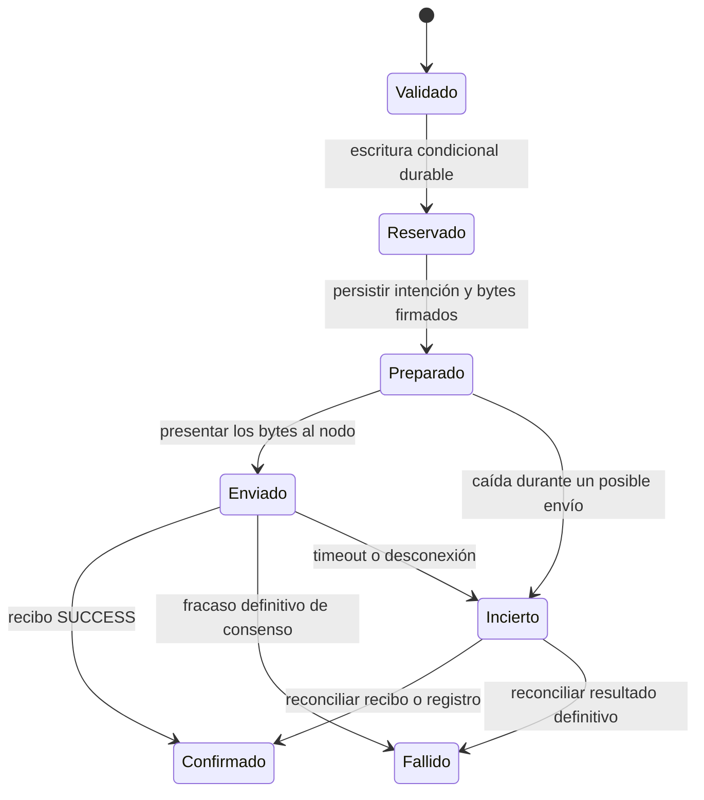

---

> **Corrección de alcance, 2026-09-17:** se retira HBAR como activo de pago. El producto admite exclusivamente USDC nativo en Hedera mainnet/testnet; HBAR queda para comisiones. Las secciones HBAR/HTS de este plan describen el alcance histórico, no la política vigente. Véase [plan maestro de recibos](facilitator-receipts-master-plan.md).
date: 2026-09-15
tags:
  - type/backlog
  - domain/hedera
  - priority/p0
status: facilitator-and-sdks-mainnet-testnet-published-verified
---

# Hedera nativo en el facilitador: investigación y plan de ejecución

**Fecha:** 2026-09-15.
**Prioridad:** P0 del facilitador, asignada por el usuario el 2026-09-15.
**Estado actualizado 2026-09-16:** proveedor nativo publicado en testnet y mainnet; canarios públicos HBAR/USDC confirmados en ambas redes, con reconciliación de importes, firmas persistidas y comisiones. Recuperación real aprobada en testnet. SDK Python 0.85.0 y TypeScript 2.93.0 publicados; ocho pagos reales adicionales desde instalaciones limpias verificados. Landing, Swagger, descubrimiento y OG publicados en 2.33.1. [Guía y evidencia actual](../guides/hedera-native.md).
**Base local:** `dc109511`, rama `0xultravioleta/hedera`.
**Objetivo:** verificar y liquidar pagos x402 con HBAR y tokens fungibles de Hedera Token Service (HTS), primero en testnet y después en mainnet, desde nuestro facilitador Rust.

## 1. Decisión recomendada

Implementar el esquema oficial **`exact` de x402 v2**, con las redes **`hedera:testnet` y `hedera:mainnet`**, mediante un proveedor nativo `HederaProvider` y el SDK Rust de Hiero. El cliente autoriza el débito; nuestra cuenta `feePayer` patrocina las comisiones de red y presenta la transacción.

El primer lanzamiento incluirá HBAR, USDC nativo y otros HTS fungibles configurados explícitamente, inicialmente sin comisiones personalizadas. Esto permite pagos reales en Hedera con el cliente oficial `@x402/hedera`, sin desarrollar un protocolo propio. La referencia normativa es la [especificación oficial](https://github.com/x402-foundation/x402/blob/6b9302737f16eea7de90b3bf617c045cef23e032/specs/schemes/exact/scheme_exact_hedera.md).

El plan y la [evidencia de consultas públicas](../reports/hedera-native-x402-evidence-2026-09-15.json) se redactaron el 2026-09-15. Las fases originales se conservan abajo como criterios de aceptación; el estado actual y los comprobantes están en la [guía operativa](../guides/hedera-native.md).

## 2. Qué ocurrió con el soporte anterior

| Fecha | Evidencia | Qué incorporaba o retiraba |
|---|---|---|
| 2026-04-04 | Commit local `66d34e6c` | Redes EVM 295/296, configuración RPC, contratos ERC-8004 y presentación en el sitio. Su mensaje declara expresamente que todavía no había pagos x402. |
| 2026-05-30 | Commit local `278842e5`, PR #20 | Retiró Hedera del código, configuración y sitio porque no tenía pagos x402; alineó el sitio con `/supported`. |
| 2026-09-15 | Código local y consulta pública | No hay proveedor Hedera ni una capacidad Hedera publicada por nuestro `/supported`. |

Se revisaron [el análisis inicial](../reports/hedera-integration-analysis.md) y [el informe de abril](../reports/hedera-x402-feasibility-2026-04.md). Sus conclusiones mezclaban la viabilidad de EIP-3009 con la de x402 en general. La ausencia de EIP-3009 en USDC HTS no impide usar el esquema nativo.

Hay una corrección histórica relevante: la especificación Hedera se integró en upstream el **6 de febrero de 2026**, en [PR #792](https://github.com/x402-foundation/x402/pull/792). Por tanto, la afirmación de abril de que todavía había que crear un esquema upstream ya era incorrecta. El **3 de julio** se reforzó la verificación de firmas en [PR #2707](https://github.com/x402-foundation/x402/pull/2707).

**Reutilización:** rescatar del historial el logo, los nombres y material documental que siga siendo válido. Diseñar el proveedor sobre la arquitectura actual. Los cambios anteriores de EVM/ERC-8004 no implementan el flujo de pago que necesitamos.

## 3. Ecosistema comprobado hoy

La [página vigente de facilitadores de Hedera](https://docs.hedera.com/solutions/ai/x402/facilitators.md) ya enumera el facilitador oficial de x402 y Blocky402. No se debe presentar a Blocky402 como la única implementación existente.

Se hicieron exclusivamente consultas HTTP de lectura:

| Servicio | Resultado de `GET /supported` | `feePayer` anunciado |
|---|---|---|
| [x402 oficial](https://x402.org/facilitator/supported) | HTTP 200, v2 `exact`, `hedera:testnet` | `0.0.9185802` |
| [Blocky402 testnet](https://api.testnet.blocky402.com/supported) | HTTP 200, v2 `exact`, `hedera:testnet` | `0.0.7162784` |
| [Blocky402 mainnet](https://api.blocky402.com/supported) | HTTP 200, v2 `exact`, `hedera:mainnet` | `0.0.10571514` |
| [Ultravioleta](https://facilitator.ultravioletadao.xyz/supported) | HTTP 200, ninguna entrada Hedera | No aplica |

Estas respuestas prueban capacidades **anunciadas**, no una liquidación real ni la seguridad de esos servicios. Las cuentas de la tabla pertenecen a esos facilitadores: nuestros ejemplos y despliegue deben usar cuentas propias.

### Referencias de implementación y versiones

| Recurso | Estado observado | Uso en el proyecto |
|---|---|---|
| [x402 oficial, mecanismo Hedera](https://github.com/x402-foundation/x402/tree/6b9302737f16eea7de90b3bf617c045cef23e032/typescript/packages/mechanisms/hedera) | Código de cliente, servidor, facilitador, firmas, preflight y pruebas | Referencia de interoperabilidad y generador de vectores. |
| [Paquete npm `@x402/hedera`](https://www.npmjs.com/package/@x402/hedera) | Publicado `2.25.0`; depende de `@x402/core ~2.25.0`, `@hiero-ledger/sdk 2.85.0` y `@hiero-ledger/proto 2.31.0` | Fijar versiones y lockfile para las pruebas cruzadas. |
| [Hiero Rust SDK](https://github.com/hiero-ledger/hiero-sdk-rust) | Crate `hiero-sdk`: estable publicado `0.45.0`; GitHub también tiene tag `v0.46.0` | Probar primero el publicado. Un tag más reciente no demuestra disponibilidad en crates.io. |
| [Crate anterior `hedera`](https://crates.io/crates/hedera) | Último estable observado `0.43.0` | Evitar iniciar una dependencia nueva con el nombre antiguo por costumbre. |
| [Demo `hedera-dev/x402-hedera`](https://github.com/hedera-dev/x402-hedera) | README de fork alpha v1 | Contexto histórico, no contrato de compatibilidad del lanzamiento. |
| [Blocky402](https://blocky402.com/) | Documentación y endpoints accesibles; el enlace público a `blockydevs/blocky402` devolvió 404 | Comparar capacidades públicas; su código no pudo auditarse desde ese enlace. |

**Corte upstream utilizado:** `6b9302737f16eea7de90b3bf617c045cef23e032`. SDK Rust: tag `v0.45.0` en `390a06e9e620a334f62fd1cfdece23a44889f449`; tag `v0.46.0` en `3b0696e842ba43b07f2a926eaffde71a723f05c4`. Revalidar versiones al ejecutar la fase 0.

## 4. Contrato de integración

| Campo | Valor o interpretación |
|---|---|
| Versión / esquema | `x402Version: 2`, `scheme: "exact"` |
| Red | `hedera:mainnet` o `hedera:testnet` |
| HBAR | `asset: "0.0.0"`; importe entero en tinybars; 1 HBAR = 100 000 000 tinybars |
| HTS | ID nativo del token; importe entero en sus unidades mínimas |
| Destino | Cuenta Hedera en `payTo` |
| Patrocinador | Cuenta propia en `extra.feePayer` |
| Autorización | `payload.transaction`: bytes serializados de una transferencia parcialmente firmada, en Base64 |

El cliente fija la cuenta de `transactionId` al patrocinador y firma. El facilitador inspecciona la transferencia, valida al remitente y añade su firma. La liquidación necesita un recibo de consenso satisfactorio. [Esquema](https://github.com/x402-foundation/x402/blob/6b9302737f16eea7de90b3bf617c045cef23e032/specs/schemes/exact/scheme_exact_hedera.md), [envío y recibo en el SDK de referencia](https://github.com/x402-foundation/x402/blob/6b9302737f16eea7de90b3bf617c045cef23e032/typescript/packages/mechanisms/hedera/src/signer.ts).

### Activos comprobados por Mirror Node

| Activo | Mainnet | Testnet | Decimales |
|---|---|---|---|
| HBAR | `0.0.0` | `0.0.0` | 8 |
| USDC nativo | `0.0.456858` | `0.0.429274` | 6 |

Las consultas de [USDC mainnet](https://mainnet-public.mirrornode.hedera.com/api/v1/tokens/0.0.456858) y [USDC testnet](https://testnet.mirrornode.hedera.com/api/v1/tokens/0.0.429274) devolvieron `FUNGIBLE_COMMON`, no borrado y listas vacías de comisiones fijas/fraccionales. Son observaciones de este corte, no propiedades inmutables: hay que volver a consultar metadata al admitir pagos.

### Discrepancia que debemos resolver con interoperabilidad

El ejemplo de liquidación de la especificación usa `transactionId` y describe `payer` como patrocinador. El [facilitador TypeScript actual](https://github.com/x402-foundation/x402/blob/6b9302737f16eea7de90b3bf617c045cef23e032/typescript/packages/mechanisms/hedera/src/exact/facilitator/scheme.ts) devuelve **`transaction` con el ID Hedera y `payer` con el remitente del activo**; su `/verify` también identifica al remitente. El [protocolo v2 general](https://github.com/x402-foundation/x402/blob/6b9302737f16eea7de90b3bf617c045cef23e032/specs/x402-specification-v2.md) utiliza `transaction`.

**Decisión propuesta:** adoptar el contrato del SDK vigente: `transaction` y remitente real en `payer`. Mantener `feePayer` como identidad separada. Añadir `transactionId` como alias aditivo para Hedera si la prueba de cliente confirma que se ignora sin problemas. Documentar que esto sigue el SDK y difiere del ejemplo específico. Preparar una corrección upstream cuando exista evidencia; no condicionar el desarrollo a una respuesta externa.

Un ID `0.0.x@segundos.nanosegundos` y el hash de la transacción son datos distintos. El primero ocupará el campo interoperable `transaction`; un hash de consenso, si se almacena, tendrá campo separado.

## 5. Alcance de la primera versión

### Incluido

- Proveedor Rust nativo para mainnet y testnet, con habilitación independiente.
- `/supported`, `/verify`, `/settle` y recorrido HTTP completo con cliente/merchant oficiales v2.
- HBAR, USDC y registro configurable de otros HTS fungibles sin comisiones personalizadas.
- Firmas Ed25519 y ECDSA secp256k1; evaluación acotada de KeyList y threshold, incluidas listas anidadas. Cada cuenta debitada debe autorizar su parte.
- Validación estricta de operaciones, importes, patrocinador y bytes firmados.
- Persistencia para concurrencia, reintentos y recuperación tras reinicios.
- Estado de salud, métricas por activo, configuración, documentación y presentación coherente con `/supported`.

### Extensiones posteriores

- HTS con comisiones personalizadas, tras diseñar y probar cómo conservar el importe recibido y quién asume cada comisión.
- Creación automática de cuentas por alias, cuentas gobernadas por contratos y hooks: requieren una política y pruebas propias.
- Compatibilidad v1 del fork histórico, si aparece un consumidor real que la necesite.
- ERC-8004 en Hedera EVM, USDT0 EVM, escrow, `upto` y pruebas DX402 específicas. No son requisitos para liquidar HBAR/HTS por `exact`.
- Cliente de firma Hedera en nuestros SDK Rust/TypeScript: el criterio inicial es interoperar con `@x402/hedera`; ampliar SDK propios después tiene alcance adicional.

Publicar las restricciones iniciales de HTS. El motor no debe prometer cualquier token si su política solo admite tokens configurados.

## 6. Cambios necesarios en este repositorio

| Área | Archivos existentes que revisar | Cambio previsto |
|---|---|---|
| Redes | `src/network.rs`, `src/caip2.rs` | `NetworkFamily::Hedera`, namespace `hedera`, mainnet/testnet, aliases locales y conversiones. No anunciar `eip155:295/296` para pagos nativos. |
| Payload y cuentas | `src/types.rs`, `src/types_v2.rs` | Representación Hedera y selección por red; conservar versiones y requisitos al normalizar. |
| Proveedor | `src/chain/mod.rs`, `src/provider_cache.rs`, `src/from_env.rs`, `src/main.rs`, `src/lib.rs` | Registrar proveedor, cliente nativo, signer, configuración y almacenamiento. |
| Implementación nueva | `src/chain/hedera/mod.rs`, `codec.rs`, `verify.rs`, `settle.rs`, `mirror.rs`, `config.rs` | Separar inspección pura, consultas y operaciones que firman/envían. Nombres propuestos. |
| Almacenamiento | `src/nonce_store.rs`, `src/idempotency_store.rs`, `src/transaction_store.rs` | Reutilizar contratos útiles; añadir estado durable de liquidación Hedera donde falte. |
| HTTP / capacidades | `src/facilitator_local.rs`, `src/handlers.rs`, `src/types_v2.rs`, `src/openapi.rs` | Routing, errores, respuestas y discovery v2 con `feePayer` y signers correctos. |
| Políticas existentes | `src/facilitator_local.rs`, `crates/x402-compliance`, `src/dx402`, `src/erc8004` | Extraer las cuentas reales de Hedera para el screening existente; delimitar extensiones compatibles antes de firmar. |
| Disponibilidad | `src/readiness.rs`, `src/chain/failure.rs`, `src/telemetry.rs`, `src/events.rs` | Salud nativa, errores de transporte/consenso, saldo HBAR y estado incierto. |
| Activos / importes | `src/network.rs`, `src/types.rs`, `src/discovery_price.rs`, `config/supported_tokens.json` | HBAR con 8 decimales, HTS con metadata propia, importes nativos sin conversión implícita a USD. |
| Sitio y balances | `static/`, `lambda/balances/handler.py`, `scripts/verify_landing_canonical.py`, `scripts/stablecoin_matrix.py` | Logo, red, explorador y balance de cuenta nativa; counts derivados de capacidades reales. |
| Compilación / despliegue | `Cargo.toml`, `Cargo.lock`, `Dockerfile`, `.github/workflows/ci.yaml`, scripts de build, `terraform/environments/production/` | Feature `hedera`, dependencias, ambos builds Docker, secretos/configuración y permisos de persistencia. |
| Documentación | `.env.example`, `README.md`, `config/README.md`, informes de abril, `.claude/skills/add-network/SKILL.md` | Ejemplos nativos y corrección del supuesto de que todo x402 requiere EIP-3009. |

### 6.1 Colisión real de payloads: Hedera y Solana

`ExactSolanaPayload` ya contiene únicamente `{ "transaction": "..." }`, y `ExactPaymentPayload` usa `serde(untagged)`. Añadir otra variante igual hace que la primera capture ambas redes.

**Implementación prevista:** deserializar el envelope con acceso a `network` o `accepted.network` y elegir el payload con esa información. Conservar el JSON externo. Las conversiones v2 al modelo interno también deben usar la red. No resolver el problema cambiando el orden de variantes. Probar los envelopes actuales y el payload Solana de Crossmint como regresiones.

### 6.2 Colisión real de direcciones: Hedera y NEAR

La expresión regular actual de NEAR en `MixedAddress` admite cadenas con puntos como `0.0.1234`. Clasificar globalmente estas cadenas como Hedera cambiaría el significado de cuentas válidas de otra red.

**Implementación prevista:** introducir un tipo validado de entity ID y normalizar `payTo`, `asset`, remitentes y `feePayer` en contexto Hedera. No confiar en la clasificación heurística de `MixedAddress` al recibir el envelope. Mantener el comportamiento de las demás redes y probar ambas interpretaciones con sus redes explícitas.

### 6.3 Versiones y capacidades

`PaymentPayloadV2::to_v1()` asigna actualmente V1 al modelo interno. Debemos validar la versión externa y la igualdad entre `accepted` y `paymentRequirements` antes de perder esa información, o conservarla explícitamente en el contexto normalizado. Incluye importe, activo, destino, red, esquema, timeout y `feePayer`.

Además, `network_form_counterpart()` replica automáticamente capacidades entre v1 y v2. Hedera debe emitir exclusivamente v2 al inicio. Añadir una política explícita de versiones por proveedor/red, conservando los anuncios actuales de las otras redes. Un alias de nombre no demuestra soporte de una versión del protocolo.

Revisar `SupportedPaymentKindsResponseV2.signers`: usar cuentas propias de los proveedores habilitados. Para una sola red puede anunciarse `hedera:*`; con mainnet/testnet y signers distintos, preferir claves específicas si el cliente oficial las admite. Probar la selección y evitar que una unión de cuentas se interprete como intercambiable entre redes.

### 6.4 Persistencia y resultado de liquidación

El `NonceStore` existente dispone de operaciones atómicas. El cache `Idempotency-Key` documenta que dos solicitudes pueden atravesarlo simultáneamente. El índice `TransactionStore` escribe después del resultado y tolera fallos. Ninguno de los dos últimos reemplaza un registro durable que controle el envío.

Diseñar un registro Hedera con clave `(network, transactionId)` y fingerprint del intento validado. Debe distinguir el mismo pago de otro contenido que reutiliza el ID, y normalizar de forma explícita las variantes por nodo del mismo intento.



- `/verify` consulta replay, pero no consume el pago ni firma como patrocinador.
- `/settle` vuelve a validar, reserva una sola vez y conserva el ID original.
- La reserva incorpora recuperación tras caída del proceso: lease/propietario y reclamación controlada; no dejar reservas abandonadas para siempre.
- El mismo ID con distinto intento debe rechazarse. Un reintento idéntico devuelve el resultado guardado o el estado pendiente.
- Persistir los bytes que podrían haberse enviado permite recuperar la ventana entre envío y actualización del estado. Nunca generar otro ID para resolver un timeout.
- No liberar una reserva si el envío pudo ocurrir. Fallar cerrado si la persistencia requerida está indisponible.
- Documentar TTL por validez de transacción, margen de reloj, ventana de reconciliación y retención de recibos. El borrado diferido de DynamoDB no equivale a un reloj de expiración preciso.

### 6.5 Extensiones, screening y métricas

Revisar todos los `match` sobre red/payload/dirección. El screening debe trabajar con remitentes inferidos y destino del pago validado. Un entity ID no es una clave pública ni una dirección EVM equivalente; la extracción no puede delegarse al parser Solana/NEAR.

DX402 y ERC-8004 tienen supuestos sobre identidad, claves y pruebas de pago. Un pago Hedera con una extensión todavía incompatible debe rechazarse **antes** de liquidar. No generar pruebas de identidad a partir de `0.0.x`, ni atribuir el pago al patrocinador. Las capacidades globales de extensiones necesitan acotarse cuando corresponda.

HBAR no es USD. Registrar cantidad base, activo, decimales y moneda; los totales monetarios no deben tratar 1 HBAR como 1 dólar ni imponer seis decimales a todo HTS.

## 7. Política inicial de verificación y patrocinio

Las siguientes son decisiones de implementación para nuestro proveedor, adicionales a la lectura de la especificación. Convertirlas en pruebas de comportamiento antes de habilitar la firma:

1. **Decodificación acotada.** Limitar tamaño Base64, bytes, número de variantes por nodo, transferencias, firmas y profundidad de listas de claves. Verificar el contenedor protobuf real emitido por el SDK, no asumir que Base64 encierra directamente un único body.
2. **Inspección de todas las variantes.** Un cliente puede serializar cuerpos para varios nodos. Cada cuerpo que el SDK pueda enviar debe representar la misma intención y estar firmado correctamente. Usar únicamente nodos de la red configurada. No inspeccionar solo el primer cuerpo y firmar toda la lista.
3. **Preservación de bytes.** Firmar cuerpos ya congelados sin reconstruir importes, ID, memo, fee ni nodo. Comprobar bytes y firmas antes y después de la cofirma. Rechazar campos/operaciones que el codec no pueda inspeccionar de forma segura.
4. **Transferencia simple.** Rechazar schedules, batches, NFTs, allowances `isApproved`, hooks y operaciones laterales. Para HTS inicial, exigir ausencia de transferencias HBAR explícitas. El pago de comisión de red no requiere una transferencia de principal desde el patrocinador.
5. **Cuentas e importes.** IDs normalizados en contexto de red; importes positivos dentro de `i64`, cálculos con overflow comprobado. Rechazar entradas duplicadas/ambiguas, destinos adicionales y diferencias entre los bytes y los requisitos.
6. **Patrocinador propio.** `extra.feePayer`, cuenta del transaction ID y signer configurado deben concordar. Rechazar cada entrada negativa del patrocinador, aunque otra entrada la compense. Puede ser destinatario si es precisamente `payTo`.
7. **Firmas reales.** Consultar la clave de cuenta y comprobar la autorización de todos los debitados sobre los bytes congelados. Soportar Ed25519/ECDSA y listas/umbrales válidos; rechazar claves desconocidas o contract keys no soportadas. Verificar asimismo requisitos de firma del receptor cuando existan.
8. **Tiempo y comisiones.** Validar valid-start, duración, expiración y margen restante para consenso frente a política local y `maxTimeoutSeconds`. Exigir un máximo de comisión aceptable; no modificar el límite ya firmado. Acotar consultas pagadas, reintentos y gasto total de patrocinio.
9. **Estado de cuentas/tokens.** Cuenta existente, balances, asociaciones, estado deleted/paused/frozen/KYC y tipo fungible. Primera versión exige asociación previa de remitente y receptor; rechazo documentado de autoasociación. Revisar las comisiones personalizadas actuales aunque el token esté en la allowlist.
10. **Consultas confiables.** URLs y nodos proceden de configuración local. Acotar timeout, tamaño y paginación del Mirror Node, validar origen de enlaces `next`, y tratar respuestas incompletas como imposibilidad de verificar. Preflight no reserva fondos ni garantiza consenso.
11. **Redes separadas.** Los cuerpos nativos no deben presumirse vinculados criptográficamente al identificador CAIP-2. Usar cuentas/claves de patrocinio distintas por red y comprobar el cliente/nodo elegido; ninguna firma destinada a testnet debe poder activar nuestro signer mainnet.

El [código de firmas](https://github.com/x402-foundation/x402/blob/6b9302737f16eea7de90b3bf617c045cef23e032/typescript/packages/mechanisms/hedera/src/signer.ts), el [preflight oficial](https://github.com/x402-foundation/x402/blob/6b9302737f16eea7de90b3bf617c045cef23e032/typescript/packages/mechanisms/hedera/src/preflight.ts) y el [SDK Rust de transacciones](https://github.com/hiero-ledger/hiero-sdk-rust/blob/v0.45.0/src/transaction/mod.rs) son referencias de implementación. Sus helpers no sustituyen nuestra inspección del mensaje completo.

### Consenso y estado incierto

`execute()` aceptado por un nodo no basta para responder `success: true`. Esperar el recibo. Clasificar por separado firma inválida, saldo/asociación insuficiente, expiración, patrocinador sin HBAR, transporte y resultado desconocido. [Implementación de envío oficial](https://github.com/x402-foundation/x402/blob/6b9302737f16eea7de90b3bf617c045cef23e032/typescript/packages/mechanisms/hedera/src/signer.ts).

En un timeout tras posible envío, conservar el transaction ID y conectar el caso al tratamiento existente de `SettlementUnconfirmed` o a su equivalente compatible. `DUPLICATE_TRANSACTION` exige consultar el resultado original; por sí solo no demuestra éxito.

## 8. Fases ejecutables y criterios de salida

Los tiempos son una estimación inicial de ingeniería, no mediciones ni compromiso de calendario. Deben ajustarse tras la fase 0.

| Fase | Trabajo y entregable | Criterio de salida | Estimación |
|---|---|---|---|
| **0. Contrato y SDK** | Fijar dependencias, generar vectores oficiales HBAR/HTS/firmas, probar decode → cofirma → decode TS/Rust; definir respuesta, versiones y estado durable. | Preservación demostrada de bodies y firmas, todas las variantes inspeccionables, compilación del SDK en entorno objetivo, decisiones de wire cerradas. | 2–3 días |
| **1. Tipos y routing** | CAIP-2, familia, cuentas, payload por red, feature, proveedor deshabilitado por defecto y OpenAPI. | Requests oficiales v2 llegan al proveedor; no colisión Solana/NEAR; no anuncio v1 inventado; regresiones existentes pasan. | 2–3 días |
| **2. Verificación** | Codec estricto, firmas, preflight, límites, política HTS y screening. | Matriz de pagos válidos y adversariales pasa; el endpoint nunca patrocina durante `/verify`. | 3–5 días |
| **3. Liquidación durable** | Cofirma, envío, recibo, reservas atómicas, reconciliación y errores inciertos. | Una sola liquidación lógica ante concurrencia/reintentos/reinicio; cero éxito antes de consenso. | 3–4 días |
| **4. Testnet y operación** | Recorrido merchant/cliente oficial, balances, readiness, métricas, documentación, Docker/CI y configuración de staging. | HBAR + USDC + FT de prueba liquidados y conciliados; sin regresiones de otras redes. | 2–3 días |
| **5. Mainnet y publicación** | Configuración propia, canario de importes mínimos, observación, documentación pública y preparación de listados. | Evidencia mainnet con recibos y saldos; retirada de nuevas admisiones y reconciliación ensayadas. | 2–3 días más observación |

**Total orientativo:** 14–21 días de ingeniería, aproximadamente 3–5 semanas según disponibilidad de cuentas, CI y revisión. La fase 0 permite empezar de forma independiente de credenciales mainnet.

### Fase 0: instrucciones concretas para el siguiente turno

1. Confirmar `git status`, HEAD y versiones publicadas actuales. Mantener esta investigación como corte histórico.
2. Crear `tests/hedera-e2e/` y fijar paquetes oficiales `2.25.0` y sus SDK/proto compatibles, o documentar una actualización deliberada.
3. Generar fixtures sin fondos usando claves de prueba deterministas: HBAR, USDC, varios nodos, Ed25519, ECDSA y umbral. Guardar expectativas de cuentas/importes/IDs y hashes de bodies.
4. Probar en un spike aislado `hiero-sdk = "=0.45.0"`; confirmar `AnyTransaction::from_bytes`, downcast a transferencia, `PublicKey::verify_transaction`, inspección de protobuf y cofirma sin modificación del body. Son candidatos verificados por lectura de código; aún falta ejecutar el experimento.
5. Si se necesita acceso directo al protobuf, declarar dependencias compatibles con el SDK y fijarlas; no depender de campos privados del SDK. Comprobar que getters agregados no oculten flags, duplicados u operaciones no soportadas.
6. Medir compilación/dependencias y comprobar `protoc`/OpenSSL. El Dockerfile actual instala OpenSSL pero no `protobuf-compiler`; determinar si hace falta para el crate publicado y añadirlo si corresponde.
7. Probar los envelopes HTTP que realmente emiten `@x402/core`, `@x402/fetch` y el merchant. Cerrar `transaction`/`transactionId`, significado de `payer` y selección de `signers` por red.
8. Redactar la decisión de codec/persistencia y convertir la fase 1 en el primer cambio de producción, conservando Hedera deshabilitado hasta completar las pruebas.

### Condición alternativa si el SDK Rust no supera la fase 0

Evaluar primero una versión/tag con el problema corregido y fijar un commit reproducible. Si la incompatibilidad es estructural, comparar el coste de un codec protobuf acotado con un servicio auxiliar TypeScript basado en la implementación oficial. El servicio auxiliar añade despliegue, autenticación interna y operación; es una alternativa condicionada a evidencia, no el diseño recomendado inicial. No reemplazar el esquema nativo por una ruta EVM para evitar el problema.

## 9. Pruebas de aceptación

### Compatibilidad y pago

- Cliente oficial → merchant oficial → nuestro `/verify` y `/settle` → recurso 200 y `PAYMENT-RESPONSE` legible.
- HBAR de 8 decimales; USDC de 6; un HTS de prueba con otros decimales.
- Remitentes con Ed25519, ECDSA y threshold; si hay varios remitentes, validar todos los débitos y firmas.
- Transacciones con variantes por varios nodos que el SDK oficial produzca por defecto.
- Identidad del remitente consistente en verify, settle, eventos e historial; `feePayer` identificable por separado.
- Configuración deshabilitada o incompleta no publica capacidad. Mainnet/testnet no comparten signer accidentalmente.

### Rechazos y límites

- Firmas ausentes, de otra clave, insuficientes para umbral o sobre otro body.
- Red, fee payer, token, destino o importe distintos; requisitos externos e internos divergentes.
- Sobrepago, pago insuficiente, overflow, cantidades mal formadas y entradas duplicadas.
- Débito del patrocinador, transferencia lateral, NFT, allowance, hook, batch o schedule.
- Body malicioso oculto en una segunda variante; estructura protobuf inválida, campos no soportados y exceso de tamaño.
- Cuenta inexistente, alias, asociación faltante, token restringido o con comisiones personalizadas.
- Expiración, valid-start futuro fuera de margen, fee excesivo y patrocinador sin fondos.
- Extensión solicitada que no pueda producirse para Hedera: rechazo antes de firmar.

### Concurrencia y fallos

- `/settle` concurrente en dos instancias, con y sin `Idempotency-Key`; reintento tras reinicio.
- Mismo transaction ID con contenido distinto; mismo pago con diferencias de serialización permitidas.
- Caída antes de reservar, después de reservar, después de persistir firma, después del envío y después de consenso antes de responder.
- Recibo `SUCCESS`, fracaso de consenso, `DUPLICATE_TRANSACTION`, timeout y Mirror Node retrasado/caído.
- Fallo de almacenamiento: ninguna nueva firma/envío cuando no puede registrarse de manera segura.
- Balance de destinatario, principal del remitente y comisión del patrocinador conciliados con el registro de consenso.

### Comandos previstos

```text
cargo fmt --all -- --check
cargo test --workspace --locked
cargo test --locked --features hedera --lib
cargo test --locked --features solana,near,stellar,algorand,sui,xrpl,hedera
cargo clippy --locked --all-targets --features solana,near,stellar,algorand,sui,xrpl,hedera -- -D warnings
python scripts/verify_landing_canonical.py --offline
```

Adaptar la matriz al CI vigente al implementar. Añadir tests HTTP y E2E explícitos de Hedera; las pruebas con red/fondos serán opt-in y separadas de la suite hermética. Ejecutar además build y arranque de la imagen real con el mismo conjunto de features del despliegue. Estos comandos no se ejecutaron para este cambio documental.

## 10. Configuración y lanzamiento

### Configuración propuesta

Nombres orientativos que la fase 0 debe consolidar con `from_env`:

```text
HEDERA_TESTNET_ENABLED
HEDERA_TESTNET_ACCOUNT_ID
HEDERA_TESTNET_PRIVATE_KEY
HEDERA_TESTNET_MIRROR_URL
HEDERA_MAINNET_ENABLED
HEDERA_MAINNET_ACCOUNT_ID
HEDERA_MAINNET_PRIVATE_KEY
HEDERA_MAINNET_MIRROR_URL
HEDERA_MAX_TRANSACTION_FEE_TINYBARS
HEDERA_MAX_QUERY_FEE_TINYBARS
HEDERA_SETTLEMENT_TIMEOUT_SECS
HEDERA_ALLOWED_TOKEN_IDS_TESTNET
HEDERA_ALLOWED_TOKEN_IDS_MAINNET
```

Conservar límites compartidos de red cuando correspondan. Los límites de patrocinio globales deben coordinarse entre réplicas; un contador en memoria por proceso no impone un presupuesto total. Establecer valores iniciales con mediciones de testnet y un presupuesto operativo definido antes de mainnet.

Guardar claves en el mecanismo de secretos existente, sin imprimirlas ni incluirlas en ejemplos. Usar cuentas y claves propias por red. En esta investigación no se consultaron secretos ni se verificó la disponibilidad de cuentas operativas.

### Dependencias de operación

- Cuenta patrocinadora y HBAR en cada red; payer y merchant de prueba, con asociaciones HTS previas.
- Acceso a nodos de consenso mediante SDK/gRPC y Mirror Node mediante REST. El antiguo JSON-RPC Hashio EVM no implementa por sí solo este transporte.
- Tabla/atributos e IAM para estado durable. Revisar el alcance real del deploy Terraform: el CI actual tiene targets explícitos y un gate de drift; una nueva tabla no debe quedarse únicamente declarada.
- Readiness propio para Hedera: el actual comprueba EVM y enumera las demás redes como `unchecked`. Añadir conectividad, signer y saldo HBAR suficientes sin enviar pagos como health check.
- Métricas de verify/settle, latencia de consenso, pendientes, replays, errores y gasto de HBAR. No etiquetar métricas con cada account ID o transaction ID, para evitar cardinalidad ilimitada.

### Secuencia de activación

1. Integrar código con feature y configuración apagada; verificar build de producción.
2. Habilitar testnet y ejecutar la matriz E2E con evidencias reproducibles.
3. Preparar configuración mainnet y cambios de infraestructura revisables. Habilitar con límites de importe/gasto y tráfico inicial controlado.
4. Conciliar un pago HBAR y otro USDC, observar reintentos/errores y aumentar admisiones según resultados.
5. Ante problemas, suspender nuevas admisiones y retirar el anuncio de esa red, conservando la reconciliación de pagos pendientes y el acceso a recibos. Mantener esquema de almacenamiento compatible con la versión anterior; volver al binario previo solo después de resolver su capacidad de leer pendientes.
6. Publicar soporte y evidencia. Preparar una PR de listado en [la documentación Hedera](https://github.com/hashgraph/hedera-docs) y actualizaciones de directorios x402 una vez que los endpoints estén vivos. La documentación pide URL, redes, fee payer y enlace técnico. El listado no es requisito para operar el protocolo.

## 11. Decisiones pendientes y quién las resuelve

| Decisión | Propuesta inicial | Cuándo resolver |
|---|---|---|
| SDK/codec exactos y acceso a todos los bodies | `hiero-sdk 0.45.0` publicado, protobuf compatible si hace falta | Ingeniería, fase 0. |
| Forma de respuesta y signers multi-red | Contrato SDK v2, alias aditivo de ID si procede | Ingeniería, prueba cruzada fase 0. |
| Fuente de claves de cuenta | Mirror Node con política de frescura y fallo cerrado; evaluar consulta de consenso acotada para casos sensibles/rotación | Ingeniería, fases 0–2. |
| Cuentas patrocinadoras | Cuentas propias distintas por red, no reutilizar identificadores de otros facilitadores | Operación, antes de E2E con fondos. |
| Límites de comisión y presupuesto | Medición testnet y límite durable de gasto | Ingeniería/operación, antes de mainnet. |
| Tokens adicionales iniciales | HBAR y USDC por defecto; otros FT sin custom fees mediante allowlist | Producto/operación, antes de anunciarlos. |

No hay una decisión del usuario que impida comenzar el experimento local de fase 0. Las credenciales y los presupuestos son dependencias del lanzamiento posterior, no de la investigación.

## 12. Fuentes y límites de esta investigación

### Fuentes primarias para ejecutar el plan

- [Especificación exact Hedera, fijada al corte](https://github.com/x402-foundation/x402/blob/6b9302737f16eea7de90b3bf617c045cef23e032/specs/schemes/exact/scheme_exact_hedera.md).
- [Mecanismo TypeScript oficial, código y pruebas](https://github.com/x402-foundation/x402/tree/6b9302737f16eea7de90b3bf617c045cef23e032/typescript/packages/mechanisms/hedera).
- [Pruebas unitarias del facilitador](https://github.com/x402-foundation/x402/blob/6b9302737f16eea7de90b3bf617c045cef23e032/typescript/packages/mechanisms/hedera/test/unit/facilitator.test.ts) y [configuración E2E upstream](https://github.com/x402-foundation/x402/blob/6b9302737f16eea7de90b3bf617c045cef23e032/e2e/config/mechanisms_hedera.json).
- [Documentación: facilitadores](https://docs.hedera.com/solutions/ai/x402/facilitators.md), [merchant](https://docs.hedera.com/solutions/ai/x402/merchant-integration.md), [cliente](https://docs.hedera.com/solutions/ai/x402/pay-with-x402.md), [índice de documentación actual](https://docs.hedera.com/llms.txt).
- [SDK Rust v0.45.0](https://github.com/hiero-ledger/hiero-sdk-rust/tree/v0.45.0), [crate publicado](https://crates.io/crates/hiero-sdk), [API de claves](https://github.com/hiero-ledger/hiero-sdk-rust/blob/v0.45.0/src/key/public_key/mod.rs), [transferencias](https://github.com/hiero-ledger/hiero-sdk-rust/blob/v0.45.0/src/transfer_transaction.rs).
- [Blocky402: documentación](https://blocky402.com/docs/), [redes](https://blocky402.com/docs/networks/), [API](https://blocky402.com/docs/api-reference/); capacidades contrastadas con sus endpoints públicos.
- [Redes y activos en x402](https://docs.x402.org/core-concepts/network-and-token-support) y [contexto Hedera de febrero](https://hedera.com/blog/hedera-and-the-x402-payment-standard/).

### Límites explícitos

Se revisó código local, historial, especificación, código oficial TypeScript, APIs del SDK Rust, documentación de integración y endpoints públicos. La evidencia JSON conserva observaciones y versiones; no representa una auditoría integral de los proyectos externos. El enlace de código de Blocky402 no fue accesible. No se han verificado pagos reales, latencias, coste de build, presupuesto operativo ni compatibilidad binaria TS/Rust ejecutada: son criterios expresos de las fases 0 y 4.

Se consultó la [guía local add-network](../../.claude/skills/add-network/SKILL.md) para localizar puntos de integración. Su flujo está orientado a EVM/Solana y contiene instrucciones obsoletas sobre EIP-3009 y versionado; este plan usa el código vigente y el esquema nativo para resolver esas diferencias. No se requiere ningún despliegue ni aprobación externa para dar por terminado este entregable documental.
